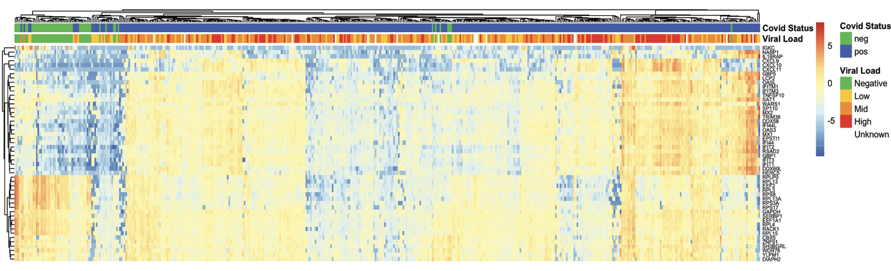
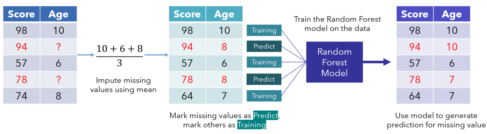
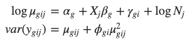
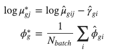

```{r, echo = FALSE}
knitr::opts_chunk$set(tidy = FALSE, tidy.opts=list(width.cutoff=80), fig.retina=3)
ggplot2::theme_set(ggplot2::theme_bw(base_size = 20))
ggplot2::update_geom_defaults("point", list(size = 3))
```

```{r xaringan-themer, include=FALSE, warning=FALSE}
library(xaringanthemer)
style_mono_accent(
  base_color = "#4E4D4F",
  header_font_google = google_font("Noto Serif Display"),
  text_font_google   = google_font("Nanum Myeongjo"),
  code_font_google   = google_font("Inconsolata"),
  base_font_size = "22px", 
  header_h1_font_size = "2rem",
  title_slide_background_size = "15%",
  title_slide_background_position = "95% 85%",
  link_color = "rgb(104, 27, 148)",
  link_decoration = "underline"
)
```

```{css, echo = FALSE}
pre {
  white-space: pre-wrap;
}
.remark-code {
  background: #f8f8f8;
}
.remark-inline-code {
  background: "white";
}
.remark-code {
  font-size: 22px;
}
.huge .remark-code { /*Change made here*/
  font-size: 200% !important;
}
.tiny .remark-code { /*Change made here*/
  font-size: 60% !important;
}
.smaller .remark-code { /*Change made here*/
  font-size: 90% !important;
}
.smaller2 .remark-code { /*Change made here*/
  font-size: 80% !important;
}
.smaller3 .remark-code { /*Change made here*/
  font-size: 70% !important;
}
```


# Background

<small>
- SARS-CoV-2, a novel coronavirus, has rapidly spread worldwide and has shown a wide range of clinical manifestations among different population groups.

- Clinically, COVID-19 cases tend to be more severe for older adults and males

- [Lieberman et al. (Plos Biology 2020)](https://journals.plos.org/plosbiology/article?id=10.1371/journal.pbio.3000849) examined host response gene expression across infection status, viral load, age, and sex among shotgun RNA sequencing profiles of nasopharyngeal (NP) swabs from 430 individuals with PCR-confirmed SARS-CoV-2 and 54 negative controls.

- Their study mainly examined gene expression differences associated with Viral load but did not report these differences for Age and Sex. 

</small>

```{r, echo=FALSE, out.width="70%", fig.show = 'hold', fig.cap = 'Figure from Lieberman et al. (Plos Biology 2020) paper', fig.align="center"}

```

---

## Project Aim

- Examine the statistical difference in gene expression profiles among SARS-CoV-2 infected patients by extending the original research to explore the interactive effects of age and sex.

- Leverage these differences in a Machine Learning model to predict infection state.

---

```{r, echo = FALSE, warning = FALSE, message = FALSE}
# read in data behind the scenes
suppressPackageStartupMessages(library(tidyverse))
suppressPackageStartupMessages(library(GEOquery))
suppressPackageStartupMessages(library(limma))
suppressPackageStartupMessages(library(edgeR))
suppressPackageStartupMessages(library(pheatmap))
suppressPackageStartupMessages(library(statmod))
suppressPackageStartupMessages(library(ggrepel))
suppressPackageStartupMessages(library(ggbiplot))
suppressPackageStartupMessages(library(ggplot2))
suppressPackageStartupMessages(library(GGally))
suppressPackageStartupMessages(library(caTools)) ## used for splitting the data into training and validation sets
suppressPackageStartupMessages(library(caret)) ## used for confusion matrix, accuracy, sensitivity, and specificity
suppressPackageStartupMessages(library(mice))
suppressPackageStartupMessages(library(VIM))
suppressPackageStartupMessages(library(sva))
suppressPackageStartupMessages(library(missForest))
suppressPackageStartupMessages(library(RANN))
suppressPackageStartupMessages(library(data.table))
suppressPackageStartupMessages(library(goseq))
suppressPackageStartupMessages(library(GOplot))
suppressPackageStartupMessages(library(clusterProfiler))
suppressPackageStartupMessages(library(org.Hs.eg.db))
suppressPackageStartupMessages(library(viridis))
suppressPackageStartupMessages(library(naniar))

#set working directory
setwd(getwd())

#data download
raw_counts = read.csv("../GSE152075/GSE152075_raw_counts_GEO.txt", sep = "")
count_mat = as.matrix(raw_counts,row.names="gene_id")

#metadata
pdata = read.csv("../GSE152075/Metadata.tsv", header = TRUE, sep = "\t")
m = subset(pdata, select = c(1,39,40,41,42,43))

#Rename metadata columns
colnames(m) = c("Sample", "Age", "Gender", "Viral_load", "Sars_test", "Batch")
m <- within(m, Age[Age == "90+"] <- "90")

#Modify the subset data
m <- m %>%
  transform(Age = as.numeric(Age))
convert = c("Gender", "Sars_test", "Batch")
m[convert] <- lapply(m[convert], factor)
m$Viral_load[m$Viral_load == "N/A"] <- 0
m$Viral_load = as.numeric(m$Viral_load)
levels(m$Gender)[3] <- NA
```

## Dataset
<small>
- Obtained from Lieberman et al. (Plos Biology 2020) paper. 

- This data was obtained in two separate files-

  - **Main data file**: expression values - one per gene, per sample ( $G$ genes $\times$ $N$ samples)
  
  - **Metadata file**: several covariates/experimental design variables for each sample ( $N$ samples $\times$ $P$ covariates). This file was modified to retain only the columns of interest that is- Sample, Age, Sex, Batch, Viral load and Sars test result.
<small>  

```{r}
# Expression matrix
dim(count_mat)
# Metadata
dim(m)
```

---

# Metadata 

```{r}
summary(m)
```

---

# Visualization of missing data

.pull-left[
```{r, echo = FALSE, warning = FALSE, message = FALSE}
# Plot missing data
gg_miss_upset(m)
```

]

.pull-right[
```{r}
#Check for percentage of missing data
pct_miss(m)
#Check for percent rows that have missing data
pct_miss_case(m)
```
]

---

```{r, echo = FALSE, warning = FALSE, message = FALSE}
pdata_mod = m %>%
  mutate(Age_category =  case_when(
    Age < 18 ~ "Child",
    Age >= 18 & Age < 35 ~ "Young Adult",
    Age >= 35 & Age < 65  ~ "Adult",
    Age >= 65 ~ "Senior"
  )) 
pdata_mod <- pdata_mod[-c(414:430), ]
data = m %>%
       dplyr::select(Sample, Age) 

data = subset(data[414:430,] )

drop <- data$Sample

#Removing samples that have unknown age from the count matrix
count_mat_final  = count_mat[,!colnames(count_mat) %in% drop]
pdata_mod$Age_category = as.factor(pdata_mod$Age_category)
```

# Data Manipulations
<small>
- Removed 17 samples from the study that did not have any associated metadata as observed previously. 
- Added a new column to the sample metadata that groups the recorded ages into four categories of Child (<18), Young Adult (18 - 35), Adult (35 - 65) and Senior (>65). 
<small>

```{r}
summary(pdata_mod)
```

---

# Data Imputation
 - MissForest is a random forest imputation algorithm for missing data, implemented in `R` in the `missForest()` package.
 
```{r, echo=FALSE, out.width="60%", fig.show = 'hold', fig.cap = 'Figure from Stekhoven and Buhlmann, creators of the algorithm', fig.align="center"}

```
 
 - **Advantages:**
  - Can be applied to mixed data types (missings in numeric & categorical variables)
  - Robust to noisy data
  - Non-parametric: makes no assumptions about the relationship between the features, unlike MICE.

- **Disadvantages:** 
  - Imputation time increases with the number of observations, predictors and missing values
  - Missing data is imputed in each run, which could be problematic in some production environments

---

# Data Imputation- Results

<small>
- After imputation, performance is assessed using the normalized root mean squared error for the continuous variables and proportion of falsely classified entries for categorical variables. 
- In both cases, good performance leads to a value close to 0 and bad performance to a value around 1.
<small>

```{r, include=FALSE}
# Convert raw counts data matrix to data frame
count_mat_mod <- count_mat %>% 
  as.data.frame() %>% 
  rownames_to_column("gene_id")

# Transform counts data to a long form for merging with metadata
count_mat_mod <- count_mat_mod %>% 
  pivot_longer(-gene_id, names_to = "Sample", values_to = "Expression")

# Join raw counts to filtered metadata. This automatically drops samples in the counts data that are not in the filtered metadata
counts_pdata <- pdata_mod %>% 
  left_join(count_mat_mod, by = "Sample")

# Transform data back to a wide format
counts_pdata <- pivot_wider(counts_pdata,
                             names_from = gene_id, 
                             values_from = Expression) %>% 
                column_to_rownames("Sample")

#data = counts_pdata

#Data Imputation
pdata.imp.1 <- missForest(counts_pdata)

#Extract imputed metadata
pdata_imputed = as.data.frame(pdata.imp.1$ximp[,1:6])
pdata_imputed <- tibble::rownames_to_column(pdata_imputed, "Sample")
```

```{r}
#Checking for performance 
pdata.imp.1$OOBerror
#Checking gender column before and after imputation
table(pdata_mod$Gender)
table(pdata_imputed$Gender)
```

---

# Batch correction using ComBat_seq

<small>
- ComBat_seq is an improved model from ComBat using negative binomial regression, which specifically targets RNA-Seq count data. 
- ComBat-seq takes untransformed, raw count matrix as input. 
- Same as ComBat, it requires a known batch variable.
<small>

.pull-left[
```{r, echo=FALSE, out.width="65%", fig.show = 'hold', fig.align="centre"}

```
]

.pull-right[
```{r, echo=FALSE, out.width="70%", fig.show = 'hold', fig.align="left"}

```
]

```{r, include=FALSE}
cov_test <- c(pdata_mod$Sars_test)
Batches = c(pdata_mod$Batch)
dim(count_mat_final)
length(Batches)
corrected_data1 <- ComBat_seq(counts = count_mat_final, batch = Batches, group = cov_test )
```

```{r}
dim(count_mat_final)
dim(corrected_data1)
```

---
# Assessment of normalized DGEList
```{r, include=FALSE}
#Creating DGE List 
dge <- DGEList(counts = corrected_data1, samples = pdata_imputed)
dim(dge)
head(apply(dge$counts, 2, sum)) # total gene counts per sample
```

.pull-left[
-Removing lowly expressed genes

```{r}
keep_edge <- rowSums(cpm(dge)>10) >= 2
```

```{r, include=FALSE}
dge_mod <- dge[keep_edge,]
```

```{r}
dim(dge)
dim(dge_mod)
```

```{r, results='hide', echo=FALSE}
# Reset library sizes
dge_mod$samples$lib.size <- colSums(dge_mod$counts) 

#Calculating TMM normalization factors and directly adding them to the DGEList
dge_norm = calcNormFactors(dge_mod, method = "TMM")

#cpm and log transformation after adding a pseudo-count
cpm = cpm(dge_norm, log = FALSE, normalized.lib.sizes = TRUE)
log2cpm = log2(cpm + 1)

#Randomly sample positive and negative samples to plot a heatmap, density plots and box plot to view the trends within the dataset.
ran_samp = pdata_mod %>%
           group_by(Sars_test) %>%
           sample_n(size = 10)
samples = ran_samp$Sample
names.use <- colnames(log2cpm)[(colnames(log2cpm) %in% samples)]
subset_data <- log2cpm[, names.use]

#Convert the subset data to long format for ease in plotting
longExpr = subset_data %>% 
           as.data.frame() %>% 
           rownames_to_column("gene") %>%
           pivot_longer(cols = !gene,
                        values_to = "Expression",
                        names_to = "Sample")
longExpr <- left_join(longExpr, ran_samp, by="Sample")

cormat = round(cor(subset_data), 2)

#Create annotation column for pheatmap
annotation_column = data.frame(Infection_state = ran_samp$Sars_test,
                               Age = ran_samp$Age_category,
                               row.names = colnames(cormat))
```


]

.pull-right[
```{r, echo=FALSE, out.width="90%", fig.show = 'hold', fig.align="right"}
#Plot heatmap
pheatmap(cormat, border_color = NA, annotation_col = annotation_column, cluster_rows = TRUE, cellheight=9, cellwidth = 9)
```
]
---
# Differential expression analyses using EdgeR

- Interaction terms: Age:Sars_test; Age:Sex; Sars_test:Sex

```{r, warning=FALSE, message=FALSE}
#Setting up model matrix
designMatrix1 = model.matrix(~Sars_test*Gender, data = pdata_imputed)
designMatrix2 = model.matrix(~Sars_test*Age_category, data = pdata_imputed)
designMatrix3 = model.matrix(~Age_category*Gender, data = pdata_imputed)[, -6]
```

<small>
- Estimating dispersion and fitting to a generalized linear model
  - Example: Interaction between Sars_test and Gender
<small>
```{r, warning=FALSE, message=FALSE}
dge_disp1 <- estimateDisp(dge_norm, designMatrix1, robust = TRUE) 
lfit1 <- glmFit(dge_disp1, designMatrix1)
lrt1 <- glmLRT(lfit1)
```

```{r, echo=FALSE, warning=FALSE, message=FALSE}
#Estimating dispersion parameters for each tag
#Model 2: Sars_test:Age_category
dge_disp2 <- estimateDisp(dge_norm, designMatrix2, robust = TRUE) 
lfit2 <- glmFit(dge_disp2, designMatrix2)
lrt2 <- glmLRT(lfit2)

#Model 1: Age_category:Gender
dge_disp3 <- estimateDisp(dge_norm, designMatrix3, robust = TRUE) 
lfit3 <- glmFit(dge_disp3, designMatrix3)
lrt3 <- glmLRT(lfit3)
```

```{r, echo=FALSE, message=FALSE, warning=FALSE}
#Filtering for up and downregulated genes - model matrix 2
deg_1 <- topTags(lrt1, n = Inf, sort.by = "logFC", p.value = 0.05)$table
up_1 <- deg_1[deg_1$logFC > 0,]
nrow(up_1)
down_1 <- deg_1[deg_1$logFC < 0,]
nrow(down_1)

#Filtering for up and downregulated genes - model matrix 2
deg_2 <- topTags(lrt2, n = Inf, sort.by = "logFC", p.value = 0.05)$table
up_2 <- deg_2[deg_2$logFC > 0,]
nrow(up_2)
down_2 <- deg_2[deg_2$logFC < 0,]
nrow(down_2)

#Filtering for up and downregulated genes - Model matrix 3
deg_3 <- topTags(lrt3, n = Inf, p.value = 0.05, sort.by = "logFC")$table
up_3 <- deg_3[deg_3$logFC > 0,]
nrow(up_3)
down_3 <- deg_3[deg_3$logFC < 0,]
nrow(down_3)
```
---
# Differentially expressed genes
```{r, echo=FALSE, message=FALSE, warning=FALSE}
#Matrix with Sars_test and Gender interaction terms
de1 <- decideTestsDGE(lrt1, adjust.method="BH", p.value = 0.05)
de1tags <- rownames(dge_disp1)[as.logical(de1)]
#plotSmear(lrt1, de.tags=de1tags)
plotMD(lrt1, main="MD plot")
abline(h=c(-1, 1), col="blue")
de1_summary <- summary(de1)
de1_summary

#Matrix with Sars_test and age_category interaction terms
de2 <- decideTestsDGE(lrt2, adjust.method="BH", p.value = 0.05)
de2tags <- rownames(dge_disp2)[as.logical(de2)]
#plotSmear(lrt2, de.tags=de2tags)
plotMD(lrt2, main="MD plot")
abline(h=c(-1, 1), col="blue")
de2_summary <- summary(de2)
de2_summary

#Matrix with Gender and age_category interaction terms
de3 <- decideTestsDGE(lrt3, adjust.method="BH", p.value = 0.05)
de3tags <- rownames(dge_disp3)[as.logical(de3)]
#plotSmear(lrt3, de.tags=de3tags)
plotMD(lrt3, main="MD plot")
abline(h=c(-1, 1), col="blue")
de3_summary <- summary(de3)
de3_summary

```

```{r, echo=FALSE, out.width="66%", fig.show = 'hold', fig.align="right", out.height="50%"}
plotMD(lrt1, main="Sars_test*Gender")
abline(h=c(-1, 1), col="blue")
```


```{r, echo=FALSE, out.width="66%", fig.show = 'hold', fig.align="centre"out.height="50%"}
plotMD(lrt2, main="Sars_test*Age_category")
abline(h=c(-1, 1), col="blue")
```


```{r, echo=FALSE, out.width="66%", fig.show = 'hold', fig.align="left"out.height="50%"}
plotMD(lrt3, main="Age_category*Gender")
abline(h=c(-1, 1), col="blue")
```
---
