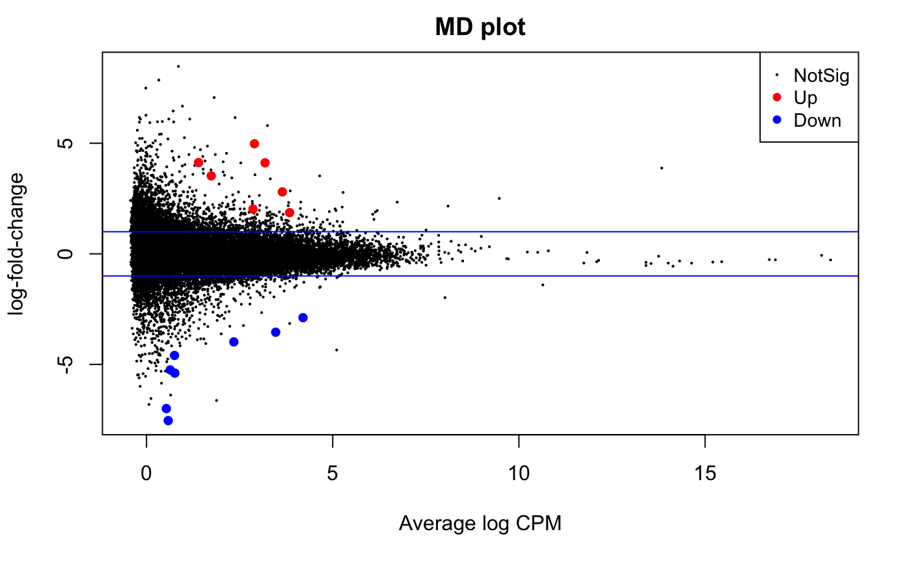
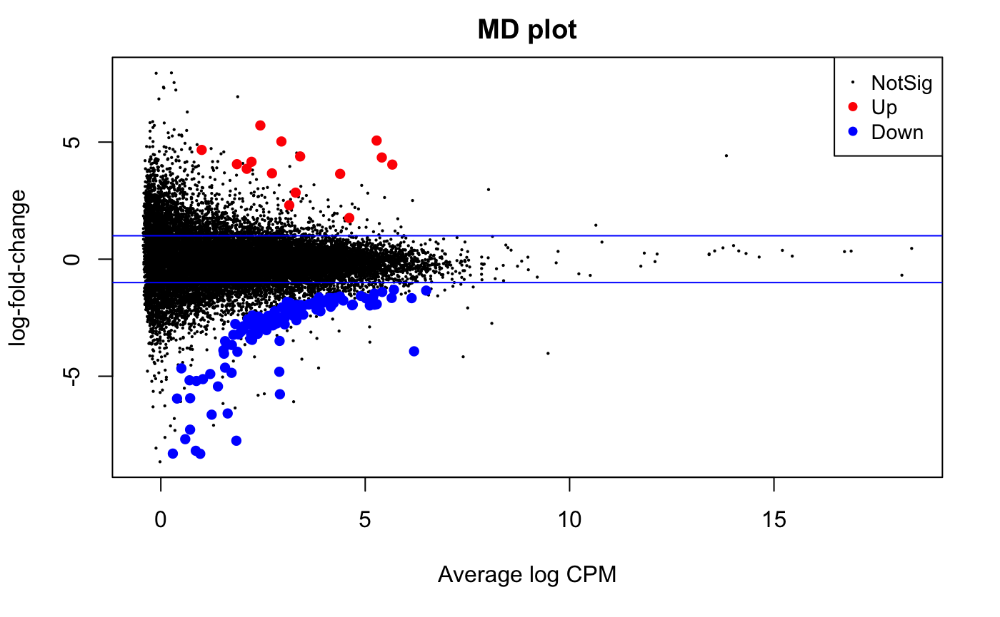
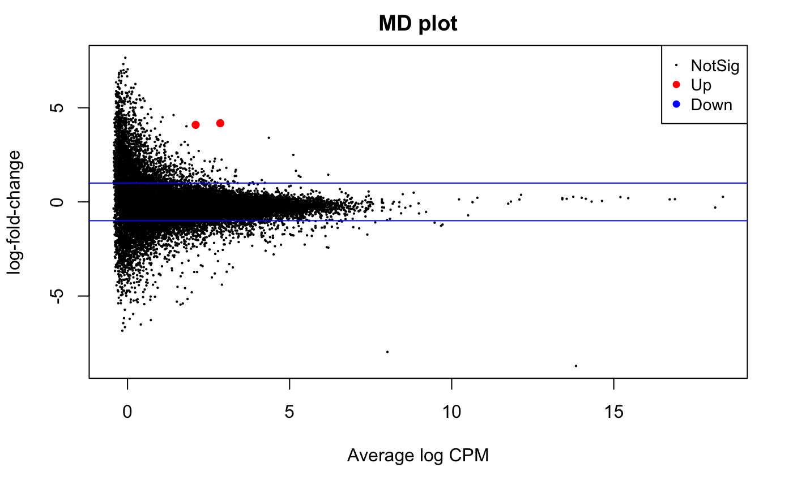
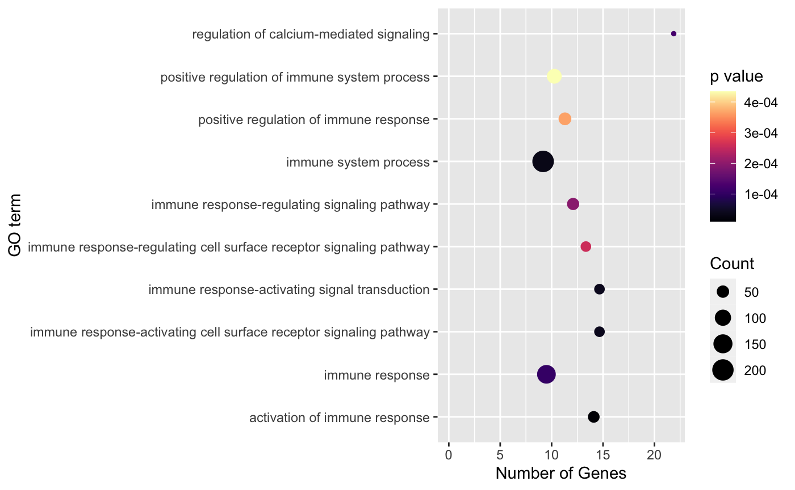
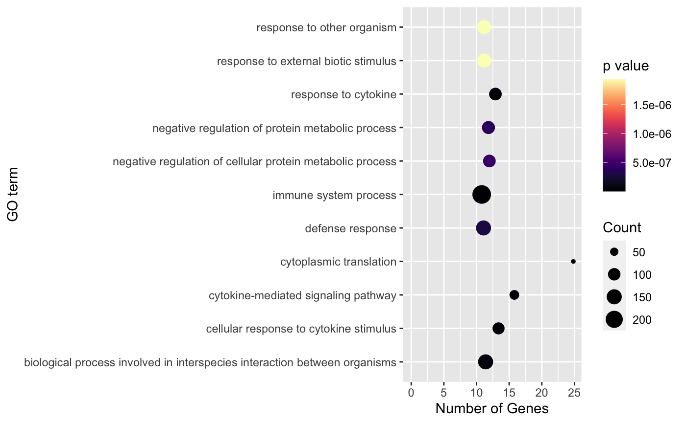
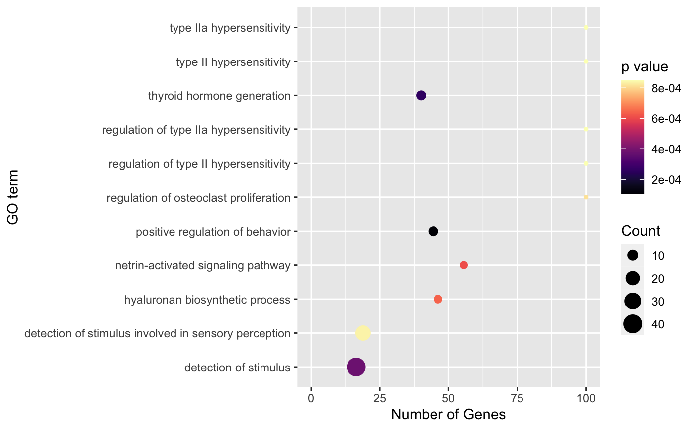

# Group Project- Host transcriptional response to SARS-Cov2 by sex and age. 

This repository contains reports and files corresponding to the [Group project](https://stat540-ubc.github.io/group_project_rubrics.html) for the STAT 540 course. 

SARS-CoV2 has shown a wide range of clinical manifestations among different population groups. Clinically, COVID-19 cases tend to be more severe for older adults and makes. The dataset used in this project was first described by Liberman et al. (2020) who examined host response gene expression across infection status, viral load, age and sex among 430 individuals with PCR-confirmed SARS-CoV2 and 54 negative controls. While the study mainly examined gene expression differences associated with viral load, they did not take into account factors such as age and sex. 

## Repository organization:

* **Presentations**: Folder containing presentation slides file
    * [Final presentation](Presentations/STAT540.pptx)

* **Results**: Folder containing the results, summary figures and/or reports of our analysis 
    * [Analysis and results (Technical report)](Results/Analysis_and_Results.md)
    * [Plots](Results/Plots)

* **Reports**: Folder containing the project proposal and progress report deliverables
    * [Initial proposal](Reports/initial_project_proposal.md)
    * [Final proposal](Reports/final_project_proposal.md)
    * [Progress report](Reports/Progress-Report.md)
    

* **src**: Folder containing our source code
    * [Datasets](src/GSE152075)
    * [Progress report code](src/Progress_report.Rmd)
    * [Completed analysis](src/imputed.Rmd)

* **README.md**- A guide through the github repository. You are currently viewing this file.

## Proposed aims and associated results 

**1) What genes are significantly differentially expressed between the two groups (healthy and infected) while accounting for factors such as age and sex?**

Using EdgeR, we generated three design matrices and identified the number of Differentially Expressed Genes (DEGs). The three design matrices examined:

- Interaction between infection status and age which resuted in 126 and 15 down and up DEGs, respectively.

- Interaction between infection status and sex which resulted in 8 and 7 down and up DEGs, respectively. 

- Interaction between age and sex which resulted in 0 and 2 down and up DEGs, respectively. 

**2) Are the differentially expressed genes (identified in aim 1) directly connected to immune response?**

For each design matrix generated in aim 1, we conducted a GO ontology analysis to examine if the genes differentially expressed have an immune function.We noticed that while design matrices 1 (interaction between infection status and age) and 2 (interaction between infection status and sex) had genes directly related to immune response, matrix 3 (interaction between age and sex) consisted of no such genes. 

- Design matrix 1:

- Design matrix 2:

- Design matrix 3:

**3) Could we leverage RNA-Seq data to predict infection status of an individual?**

Using the genes identified using design matrix 3, we build two machine learning models (KNN and logistic regression) to predict the infection status of a patient given expression values (transcriptomic data. The two models had the following accuracy metrics. 

| Model         | Sensitivity   | Specificity  | Accuracy |
| ------------- |:-------------:| :-----:| :--------------: |
| KNN           | 0.943 | 1.00 | 0.947 |
| Logistic regression      | 0.965 | 1.00 | 0.968 |

