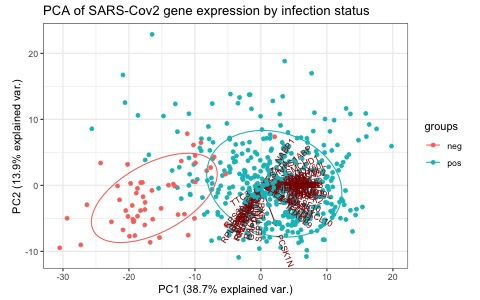
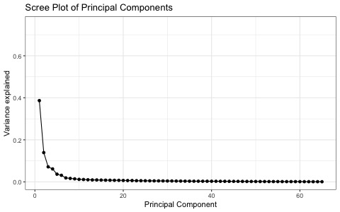

Progress Report
================
Credo Casmil, Aditi Nagaraj Nallan, Ekpereka Amutaigwe and Dollina
Dodani
2022-03-10

# WHAT HAS CHANGED BASED ON THE FINAL PROPOSAL (2 PT.)

Did your dataset change? If so, why?

**Answer:** Our dataset has not changed since the submission of our
final proposal. We are working on a SARS-CoV-2 study that is outlined in
this
[paper](https://journals.plos.org/plosbiology/article?id=10.1371/journal.pbio.3000849).
As described in our final proposal, we are still using the supplemental
file `GSE152075_raw_counts_GEO.txt` and `PhenoData` from the
`GSE152075`as a source of the raw counts and metadata, respectively.

Have you decided to do a different analysis than what was mentioned in
your proposal? If so, Why?

**Answer:** The overall analysis has not changed but we have decided to
make minor modifications to our approach one such so far was that we
initially proposed to leverage DESeq2, however, we have opted for EdgeR
because the authors of the paper have used DESeq2 and based on the
premise that no statistical modelling can fully capture all biological
phenomena, we wanted to see if a different pipeline of analysis would be
comparable to what was originally found. Further details are outlined in
our methods and the results section.

Are there any changes in task assignments of group members?

**Answer:**The task assignments of all group members remain the same.
All group members have contributed to the current progress of our
project as described in the final proposal.

# WHAT IS THE PROGRESS OF THE ANALYSES (4 PTS.)

Since your initial proposal, you should have decided more concretely on
what methods to use for each step of your analyses, and employed some of
those methods. Briefly and concisely explain your methodology and
progress for the aims you have investigated so far. Which parts were
modified and which parts remained the same?

**Answer:** So far in our project, we have obtained the count data and
meta data from the paper and Gene Expression Omnibus (GEO). We cleaned
up the metadata to include only columns of interest. We created a
DGEList for differential expression analysis. Following this we removed
lowly expressed genes, normalized the counts data based on TMM
normalization and made boxplots, density plots and heatmaps to observe
the trends within our dataset. We then calculated and filtered out the
differentially expressed genes.

We built a model to predict the infected status of a patient given their
RNA-Seq data. We used PCA analysis (prcomp function from stats package)
to reduce the dimensionality if our identified DEGs (66) to 4
components. Using the derived 4 PCs, we used a logistic regression model
(glm function from stats package) to perform the classification.

Based on the aforementioned information, aims 1 and 3 of our final
proposal were carried out and partially answered. For aim 1, we have
characterized the differentially expressed genes based on the infection
status, i.e. positive vs negative as step 1. As for aim 3, the infection
status was predicted after sub-setting our PCA data into training and
validation sets.Other than the switch from DESeq2 to EdgeR for
expression analyses, our goals as stipulated in our final proposal
remain the same.

What R packages or other tools are you using for your analyses? You do
not need to provide your scripts in your report.

**Answer:** The R packages we used for our preliminary analysis include:
\* `GEOquery` : Retrieve our data from NCBI GEO. \* `tidyverse` : Data
exploration and modifications. \* `ggplot` : Plotting our data at
various stages to visualize trends in our data. \* `edgeR` :
Differential gene expression analysis. \* `pheatmap` : Building a
heatmap to check correlation between our samples. \* `stats`: For PCA
and glm \* `caTools`: For splitting data into training and validation
sets (for classification model) \* `caret`: Building a confusion matrix,
calculating accuracy, sensitivity, and specificity

Provide the links to any markdown reports within your repo to refer to
the relevant analysis.

**Answer:** All of our code and analysis included within this progress
report can be found in the `src` folder on our github repository. Click
[here](https://github.com/STAT540-UBC-2022/project-team-11/blob/main/src/DataCleanup_DE.Rmd)
to view our code. The file containing our code is called
`DataCleanup_DE.Rmd`.

The plots generated in our analysis could be found `Results/Plots`
folder.

Provide references.

**Answer:** \*
<https://www.datacamp.com/community/tutorials/pca-analysis-r> \*
<https://www.statology.org/scree-plot-r/>

-   **RNASeq Analysis** :

The resources available on
[github](https://github.com/STAT540-UBC/resources) and shared by the
teaching team as part of the STAT 540 course were used to guide our DE
analysis. Apart from this we used the data manipulation
[tutorial](https://dplyr.tidyverse.org) from Tidyverse for the data
cleanup stage.

# RESULTS (2 PTS.)

What are your primary results?

**Answer:** Differential gene expression was observed between
individuals with negative and positive COVID infection status. 45 genes
were up-regulated while 21 were down-regulated when sequencing batch was
accounted for. When compared to what the authors of the paper found, we
can determine that we have positive results though we have \~20 less
genes than they got. This discrepancy can be attributed to the genes
that we dropped based on our high CPM and sample thresholds. The
following is a table showing the upregulated genes:

    ##  [1] "|Genes    |    logFC|   logCPM|        LR|    PValue|"
    ##  [2] "|:--------|--------:|--------:|---------:|---------:|"
    ##  [3] "|CMPK2    | 1.899225| 5.432461| 18.249487| 0.0000194|"
    ##  [4] "|CXCL10   | 4.187512| 6.435500| 19.410655| 0.0000105|"
    ##  [5] "|CXCL9    | 4.110525| 5.641219| 24.617031| 0.0000007|"
    ##  [6] "|DDX58    | 2.044954| 5.981685| 20.962829| 0.0000047|"
    ##  [7] "|DDX60    | 1.702926| 5.201112| 19.307998| 0.0000111|"
    ##  [8] "|DDX60L   | 2.049598| 6.437360| 16.327786| 0.0000533|"
    ##  [9] "|FYB1     | 1.526096| 5.593276|  8.180510| 0.0042343|"
    ## [10] "|GBP1     | 2.322803| 6.965568| 26.941275| 0.0000002|"

The following is a table showing the downregulated genes:

    ##  [1] "|Genes   |     logFC|   logCPM|        LR|    Pvalue|"
    ##  [2] "|:-------|---------:|--------:|---------:|---------:|"
    ##  [3] "|BPIFB1  | -1.138585| 6.659925|  6.195652| 0.0128065|"
    ##  [4] "|CBX5    | -1.187887| 5.366671| 10.225757| 0.0013849|"
    ##  [5] "|CCNI    | -1.051094| 5.817436| 11.889177| 0.0005646|"
    ##  [6] "|EEF2    | -1.089281| 6.478402|  6.680745| 0.0097460|"
    ##  [7] "|GAPDH   | -1.097878| 7.635841| 10.205172| 0.0014005|"
    ##  [8] "|MUC5B   | -1.427564| 5.343531|  5.055832| 0.0245432|"
    ##  [9] "|PCSK1N  | -3.299301| 7.753679|  6.870801| 0.0087615|"
    ## [10] "|PIGR    | -1.045433| 7.024179| 10.235317| 0.0013778|"

For our downstream analyses, we proposed to predict 
- If a patient has COVID-19, given their RNA-Seq 
- The strength of immune response using associated metadata, if a patient has COVID-19

We aim to build a logistic regression model to predict if a patient is
infected with COVID-19 given their RNA-seq data. Our initial DEG
analysis returns a set of 66 genes that were differentially expressed
given the infection status. While it would be ideal to use all 66 genes
to perform the classification, such a task would be not only
computationally heavy but also have a lot of noise. This noise could
arise because it is possible that some of the DEGs are correlated and
produce similar signals, hence misleading our interpretation. In order
to prevent this, we performed PCA on the DEGs.

From the above scatter plot (PC2 vs PC1), we notice that healthy
patients are well separated from COVID-19 positive patients. This
motivated us to use PCA components as our variables in the classifier
model. Through a Scree/Elbow plot, we decided to use the first four PCs
that explain \~66% of the variance in the dataset. After the four
components, we noticed that not much of information is extracted by the
other components.

Were you able to answer your hypothesis? Did you have any positive
results? If no, postulate a discussion as to why that may be. Provide
plots and/or tables to present your results.

**Answer:** We were able to answer our listed hypotheses partially. So
far, we have concluded that we have a set of 66 DEGs given the infection
status. We have also formulated a model that predicts the infected
status, given the set of DEGs. Our model had an accuracy of 95.9% with
three healthy patients misclassified as diseased and 1 infected patient
incorrectly classified as healthy.

List some challenges that you have encountered or anticipate. How will
you address them?

**Answer:** For the ML portion of our project, we anticipate that there
will be problems in predicting the natural immune response in infected
patients. This is because immune response is generated in diverse ways
in the population. We would first have to identify genes that contribute
to this response in humans (using the DAVID/goseq database) and then find a
way to categorize what a “strong” response would comprise of in
quantitative terms.
