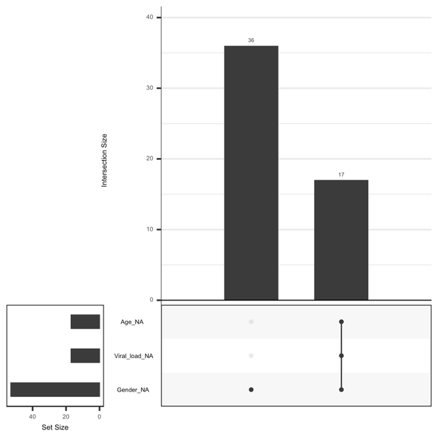

# Technical Report - Analysis and Results 

## Project aims 

Given that SARS-CoV2 has shown a wide range of clinical manifestations among different population groups, particularly affecting older adults and males more severely, we decided to do a statistical analysis addressing the following questions:

1) What genes are significantly differentially expressed between the two groups (healthy and infected) while accounting for factors such as age and sex?

2) Are the significantly differentially expressed genes directly connected to immune response?

3) Could we leverage the information from the differentially expressed genes to predict the infection status of an individual?

## Data exploration and manipulation 

We obtained our dataset from a study by [Lieberman el al. (Plos Biology 2020)](https://journals.plos.org/plosbiology/article?id=10.1371/journal.pbio.3000849) that examined host response gene expression across infection status, viral load, age, and sex among 430 individuals with PCR-confirmed SARS-CoV-2 and 54 negative controls. The data was obtained from GEO as two separate files- first being the expression/count matrix with 35784 genes in the rows and 484 samples in the columns. The second file was the metadata file with 484 samples and six metadata columns pertaining to Age, Sex, Batch, Viral load and Sars test result. Upon further exploration of the metadata, we observed that 53 samples had missing values across Age, Sex and Viral load. When we made a plot for these missing values we noticed that 17 samples had missing values across all three columns and 36 samples had missing values for Sex. The plot is shown below. 

We then went on to remove the 17 samples from our downstream analysis and these would not help inform our analysis in any way. For the remaining 36 samples, we decided to carry out data imputation using the missForest algorithm in R. We observed an error rate of 0.06 which confirmed that our imputation algorithm was performing well. 

The code for the data exploration and manipulation is located within the `src` folder in our repo and can be found [here](https://github.com/STAT540-UBC-2022/project-team-11/blob/main/src/imputed.Rmd). 

## RNA-Seq analysis

## GO ontology analysis

## Machine learning analysis

Our objective for the machine learning analysis was to be able to predict infection status of a patient, given their transcriptomic data. In order to accomplish this, we used design matrix 3 (described in RNA-Seq section above) that examines the interactive effects of age and sex. We filtered the DEGs to only include the top 100 genes (sorted by logFC) irrespective of their significance. This is because design matrix 3 provided only 2 significantly DEGs which is not enough to train a model. We picked a value of 100 to adhere to our computational limitations. 

We trained two models for our classification problem:

1) K Nearest Neighbors (KNN): 

2) Logistic regression 

## Conclusions 
