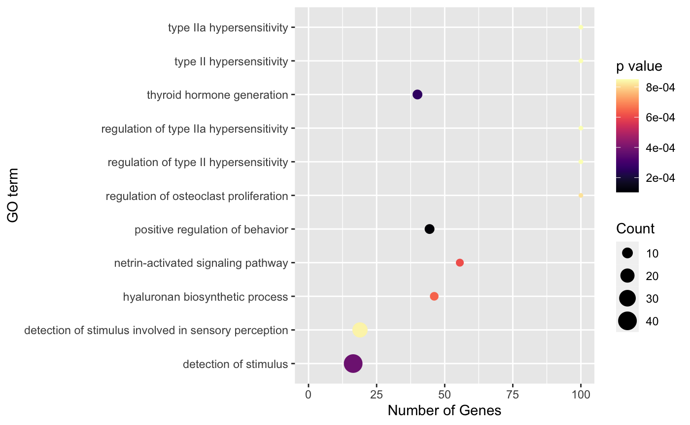

# Technical Report - Analysis and Results 

## Project aims 
Given that SARS-CoV2 has shown a wide range of clinical manifestations among different population groups, particularly affecting older adults and males more severely, we decided to do a statistical analysis addressing the following questions:

**1) What genes are significantly differentially expressed between the two groups (healthy and infected) while accounting for factors such as age and sex?**

**2) Are the differentially expressed genes (identified in aim 1) directly connected to immune response?**

**3) Could we leverage RNA-Seq data to predict infection status of an individual?**

## Data exploration and manipulation 

We obtained our dataset from a study by [Lieberman el al. (Plos Biology 2020)](https://journals.plos.org/plosbiology/article?id=10.1371/journal.pbio.3000849) that examined host response gene expression across infection status, viral load, age, and sex among 430 individuals with PCR-confirmed SARS-CoV-2 and 54 negative controls. The data was obtained from GEO as two separate files- first being the expression/count matrix with 35784 genes in the rows and 484 samples in the columns. The second file was the metadata file with 484 samples and six metadata columns pertaining to Age, Sex, Batch, Viral load and Sars test result. Upon further exploration of the metadata, we observed that 53 samples had missing values across Age, Sex and Viral load. When we made a plot for these missing values we noticed that 17 samples had missing values across all three columns and 36 samples had missing values for Sex. The plot is shown below. 

We then went on to remove the 17 samples from our downstream analysis as these would not help inform our analysis in any way. For the remaining 36 samples, we decided to carry out data imputation using the `missForest` algorithm in R. We observed an error rate of 0.06 which confirmed that our imputation algorithm was performing well. 

The code for the data exploration, manipulation and downstream analysis is located within the `src` folder in our repo and can be found [here](https://github.com/STAT540-UBC-2022/project-team-11/blob/main/src/imputed.Rmd). 

## RNA-Seq analysis

Before creating, the DGEList, `Combat_seq()` was utilized to adjust the count matrix for batch effects. This adjusted count matrix as well the modified metadata (including the imputed sex annotations) were used to build the DGEList. 

After TMM normalization and filtering of lowly expressed genes (cpm > 10 for at least 2 samples), data visualization was performed. 

The boxplot shows the distribution of gene expression levels of 20 samples. Only a small number of samples have different distributions i.e. sample 167 and 169.

Additional pairwise correlation between samples was plotted on a heat map. Based on the clustering, higher correlation was present in both negative and positive SARS tested samples as long as they were within the senior and adult age category. This was similar to what Lieberman et al. (2020) observed.

To answer our first question, we examined if interaction between infection status, age category and sex would result in differentially expressed genes. To accomplish this, 3 design matrices were made:

- Matrix 1: `infection status * Age`.

- Matrix 2: `Infection status * Sex`.

- Matrix 3: `Sex * Age`.

Applying a cutoff of |1| for the log fold change and adjust p-value of 0.05: 
- Interaction between infection status and age which resulted in 126 down and 15 up DEGs.

- Interaction between infection status and sex which resulted in 8 down and 7 up DEGs.

- Interaction between age and sex which resulted in 0 down and 2 up DEGs. 

## Gene Ontology analysis

To answer our second research question of whether the differentially expressed genes are directly connected to immune response, we performed a Gene Ontology analysis using top differentially expressed genes from the three design matrices. 

#### **Design matrix 1 (interaction between infection status and age):**

We observed a statistically significant enrichment of immune function terms and several genes associated with these functions.

#### **Design matrix 2 (interaction between infection status and sex):**

We also observed a statistically significant enrichment of immune function terms and a substantial amount of genes associated with these functions.

#### **Design matrix 3 (interaction between age and sex):**

Immune function terms were not enriched.

## Machine learning analysis

Our objective for the machine learning analysis was to be able to predict infection status of a patient, given their transcriptomic data. In order to accomplish this, we used design matrix 3 (described in RNA-Seq section above) that examines the interactive effects of age and sex. We filtered the DEGs to only include the top 100 genes (sorted by logFC) irrespective of their significance. This is because design matrix 3 provided only 2 significantly DEGs which is not enough to train a model. We picked a value of 100 to adhere to our computational limitations. 

Our data set consisting of 467 samples, 100 genes, 2 metadata variables (age and sex), and the predictor variabe (infection status). We first split our data set into a training set (80%) and a validation set (20%).

We trained two models for our classification problem:

1) K Nearest Neighbors (KNN): This model examines the k nearest points (based on Euclidean distance) to make a classification. We first scaled all explanatory variables of our data set K is user-defined and must be fine-tuned before fitting the model. We tested 20 values of k (1 to 20) and noticed that the classification error on the test set was minimum when k is 5, 7 or between 8 to 15. We decided to fit our model with k=15 using the `knn` function from `class` package to avoid over fitting of the model. 

2) Logistic regression: This model assigns a probability (0 to 1) to an unknown sample of belonging to a class (infection status positive or negative). Since we had 102 explanatory variables, we were not able to cope with the computational burden. We then decided to perform feature selection analysis using step wise logistic regression. We build a null model and a full model consisting of a constant term and all genes, respectively. Using this, we identified 3 genes (EFS, MTCO2P22 and EXOC5P1) that significantly contributed to the classification (explained most of the variance in the data set). We used the `glm` function to fit our model. 

**Model selection**

The two models acquired the follwing accuracy metrics: 

| Model         | Sensitivity   | Specificity  | Accuracy |
| ------------- |:-------------:| :-----:| :--------------: |
| KNN           | 0.943 | 1.00 | 0.947 |
| Logistic regression      | 0.965 | 1.00 | 0.968 |

We can see that while both models have a specificity of 0 (that is, no COVID-19 positive patient was misclassified as negative), they differed in accuracy scores. Logistic regression is more accurate and sensitive while making a prediction based on only three genes (compared to KNN that uses 100 genes). Thus, logistic regression would be a slightly better model.

## Conclusions 

Using the data first described by Liberman et al., we were able to accomplish our three goals. Using EdgeR we identified significantly DEGs while examining interactive effects of [infection status and age], [infection status and sex], and [age and sex]. We further leveraged GO analysis to identify genes that were directly related to the immune response system in humans. We concluded that there were no significant associations to immune function using the interaction of age and sex. Lastly, we successfully build a classification model (with an accuracy of 97%) that utilizes three genes (EFS, MTCO2P22 and EXOC5P1) to predict if an individual has COVID-19.
As future work, we would like to explore the biological mechanisms of why our model (specially the logistic regression generated such high accuracy scores). This could be done by a more detailed pathway analysis (using GO) or wet lab techniques such a knock out models. 

We also think that if we included the infection state as a covariate in the third design matrix we could have seen more DEGs and higher enrichment for immune function but we could not test this as part of our analysis. Additionally, to validate our ML model we could use a new dataset and this is also something we did not test as part of our study. 
