Load packages

``` r
suppressPackageStartupMessages(library("tidyverse"))
suppressPackageStartupMessages(library("GEOquery"))
suppressPackageStartupMessages(library("limma"))
suppressPackageStartupMessages(library("DESeq2"))
suppressPackageStartupMessages(library("edgeR"))
suppressPackageStartupMessages(library("pheatmap"))
suppressPackageStartupMessages(library("statmod"))
suppressPackageStartupMessages(library("ggrepel"))
```

``` r
eset <- getGEO("GSE152075", getGPL = FALSE)[[1]]
```

    ## Found 1 file(s)

    ## GSE152075_series_matrix.txt.gz

``` r
getGEOSuppFiles("GSE152075")
```

    ##                                                                                                                  size
    ## /Users/credo/Desktop/GSAT 540/Group Project/project-team-11/Results/GSE152075/GSE152075_raw_counts_GEO.txt.gz 7121083
    ##                                                                                                               isdir
    ## /Users/credo/Desktop/GSAT 540/Group Project/project-team-11/Results/GSE152075/GSE152075_raw_counts_GEO.txt.gz FALSE
    ##                                                                                                               mode
    ## /Users/credo/Desktop/GSAT 540/Group Project/project-team-11/Results/GSE152075/GSE152075_raw_counts_GEO.txt.gz  644
    ##                                                                                                                             mtime
    ## /Users/credo/Desktop/GSAT 540/Group Project/project-team-11/Results/GSE152075/GSE152075_raw_counts_GEO.txt.gz 2022-03-08 07:18:24
    ##                                                                                                                             ctime
    ## /Users/credo/Desktop/GSAT 540/Group Project/project-team-11/Results/GSE152075/GSE152075_raw_counts_GEO.txt.gz 2022-03-08 07:18:24
    ##                                                                                                                             atime
    ## /Users/credo/Desktop/GSAT 540/Group Project/project-team-11/Results/GSE152075/GSE152075_raw_counts_GEO.txt.gz 2022-03-08 06:59:27
    ##                                                                                                               uid
    ## /Users/credo/Desktop/GSAT 540/Group Project/project-team-11/Results/GSE152075/GSE152075_raw_counts_GEO.txt.gz 501
    ##                                                                                                               gid
    ## /Users/credo/Desktop/GSAT 540/Group Project/project-team-11/Results/GSE152075/GSE152075_raw_counts_GEO.txt.gz  20
    ##                                                                                                               uname
    ## /Users/credo/Desktop/GSAT 540/Group Project/project-team-11/Results/GSE152075/GSE152075_raw_counts_GEO.txt.gz credo
    ##                                                                                                               grname
    ## /Users/credo/Desktop/GSAT 540/Group Project/project-team-11/Results/GSE152075/GSE152075_raw_counts_GEO.txt.gz  staff

``` r
raw_counts <- read.csv("GSE152075/GSE152075_raw_counts_GEO.txt", sep = "")
count_mat <- as.matrix(raw_counts,row.names="gene_id")
```

``` r
pdata <- eset@phenoData@data %>% as_tibble()
pdata_mod <- pdata %>%
  select(title, `age:ch1`, characteristics_ch1.3, characteristics_ch1.4, `sars-cov-2 positivity:ch1`) %>%
  subset(`age:ch1` != "Unknown") %>%
  transform(`age:ch1` = as.numeric(`age:ch1`))
```

    ## Warning in eval(substitute(list(...)), `_data`, parent.frame()): NAs introduced
    ## by coercion

``` r
colnames(pdata_mod) = c("Title", "Age", "Gender", "Batch", "Sars_test")
pdata_mod[is.na(pdata_mod)] <- 90

pdata_mod = pdata_mod %>%
  mutate(Age_category =  case_when(
    Age < 18 ~ "Child",
    Age >= 18 & Age < 35 ~ "Young Adult",
    Age >= 35 & Age < 65  ~ "Adult",
    TRUE ~ "Senior"
  ))

data = pdata %>%
       select(title, `age:ch1`) %>% 
       subset(`age:ch1` == "Unknown")

drop <- data$title
count_mat_final  = count_mat[,!colnames(count_mat) %in% drop]
```

# Using Deseq

``` r
sumexp <- SummarizedExperiment(assays = SimpleList(counts = as.matrix(count_mat_final)), 
                             colData = DataFrame(pdata_mod))

assays(sumexp)$cpm <- cpm(count_mat_final, log = FALSE, normalized.lib.sizes = FALSE)
sumexp
```

    ## class: SummarizedExperiment 
    ## dim: 35784 467 
    ## metadata(0):
    ## assays(2): counts cpm
    ## rownames(35784): A1BG A1CF ... ZYXP1 ZZEF1
    ## rowData names(0):
    ## colnames(467): POS_001 POS_002 ... NEG_063 NEG_065
    ## colData names(6): Title Age ... Sars_test Age_category

``` r
keep_deseq <- which(rowSums(assays(sumexp)$cpm > 100) >= 50)
sumexp <- sumexp[keep_deseq,]

assays(sumexp)$log2cpm <- log2(assays(sumexp)$cpm + 1)
sumexp
```

    ## class: SummarizedExperiment 
    ## dim: 679 467 
    ## metadata(0):
    ## assays(3): counts cpm log2cpm
    ## rownames(679): ABCA13 ABLIM1 ... ZNF91 ZNFX1
    ## rowData names(0):
    ## colnames(467): POS_001 POS_002 ... NEG_063 NEG_065
    ## colData names(6): Title Age ... Sars_test Age_category

``` r
#Setting up model matrix
designMatrix1 = model.matrix(~Sars_test , data = colData(sumexp))
designMatrix2 = model.matrix(~Sars_test + Batch , data = colData(sumexp))
```

``` r
dds1 <- DESeqDataSet(sumexp, designMatrix1)
dds1
```

    ## class: DESeqDataSet 
    ## dim: 679 467 
    ## metadata(1): version
    ## assays(3): counts cpm log2cpm
    ## rownames(679): ABCA13 ABLIM1 ... ZNF91 ZNFX1
    ## rowData names(0):
    ## colnames(467): POS_001 POS_002 ... NEG_063 NEG_065
    ## colData names(6): Title Age ... Sars_test Age_category

``` r
dds1 <- estimateSizeFactors(dds1)
# double check that samples are in the same order in both edger and deseq objects
#identical(colnames(dge_disp), colnames(dds))

dds1 <- DESeq(dds1)
```

    ## using supplied model matrix

    ## using pre-existing size factors

    ## estimating dispersions

    ## gene-wise dispersion estimates

    ## mean-dispersion relationship

    ## -- note: fitType='parametric', but the dispersion trend was not well captured by the
    ##    function: y = a/x + b, and a local regression fit was automatically substituted.
    ##    specify fitType='local' or 'mean' to avoid this message next time.

    ## final dispersion estimates

    ## fitting model and testing

    ## -- replacing outliers and refitting for 121 genes
    ## -- DESeq argument 'minReplicatesForReplace' = 7 
    ## -- original counts are preserved in counts(dds)

    ## estimating dispersions

    ## fitting model and testing

``` r
resultsNames(dds1)
```

    ## [1] "Intercept"    "Sars_testpos"

``` r
res1 <- results(dds1)
res1 <-res1[order(res1$pvalue),]
plotMA(res1, alpha = 0.05)
```

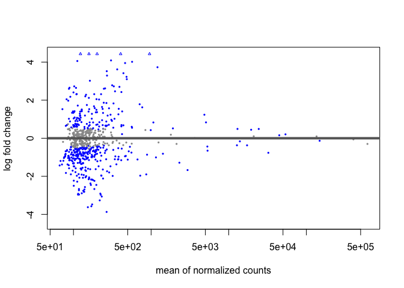<!-- -->

``` r
dds2 <- DESeqDataSet(sumexp, designMatrix2)
dds2
```

    ## class: DESeqDataSet 
    ## dim: 679 467 
    ## metadata(1): version
    ## assays(3): counts cpm log2cpm
    ## rownames(679): ABCA13 ABLIM1 ... ZNF91 ZNFX1
    ## rowData names(0):
    ## colnames(467): POS_001 POS_002 ... NEG_063 NEG_065
    ## colData names(6): Title Age ... Sars_test Age_category

``` r
dds2 <- estimateSizeFactors(dds2)
# double check that samples are in the same order in both edger and deseq objects
#identical(colnames(dge_disp), colnames(dds))

dds2 <- DESeq(dds2)
```

    ## using supplied model matrix

    ## using pre-existing size factors

    ## estimating dispersions

    ## gene-wise dispersion estimates

    ## mean-dispersion relationship

    ## final dispersion estimates

    ## fitting model and testing

    ## 1 rows did not converge in beta, labelled in mcols(object)$betaConv. Use larger maxit argument with nbinomWaldTest

    ## -- replacing outliers and refitting for 20 genes
    ## -- DESeq argument 'minReplicatesForReplace' = 7 
    ## -- original counts are preserved in counts(dds)

    ## estimating dispersions

    ## fitting model and testing

    ## 1 rows did not converge in beta, labelled in mcols(object)$betaConv. Use larger maxit argument with nbinomWaldTest

``` r
resultsNames(dds2)
```

    ##  [1] "Intercept"                "Sars_testpos"            
    ##  [3] "Batchsequencing_batch..B" "Batchsequencing_batch..C"
    ##  [5] "Batchsequencing_batch..D" "Batchsequencing_batch..E"
    ##  [7] "Batchsequencing_batch..F" "Batchsequencing_batch..G"
    ##  [9] "Batchsequencing_batch..H" "Batchsequencing_batch..I"
    ## [11] "Batchsequencing_batch..J" "Batchsequencing_batch..K"
    ## [13] "Batchsequencing_batch..L" "Batchsequencing_batch..M"
    ## [15] "Batchsequencing_batch..N" "Batchsequencing_batch..O"
    ## [17] "Batchsequencing_batch..P" "Batchsequencing_batch..Q"
    ## [19] "Batchsequencing_batch..R" "Batchsequencing_batch..S"
    ## [21] "Batchsequencing_batch..T" "Batchsequencing_batch..U"

``` r
res2 <- results(dds2)
res2 <- res2[order(res2$pvalue),]
plotMA(res2, alpha = 0.05)
```

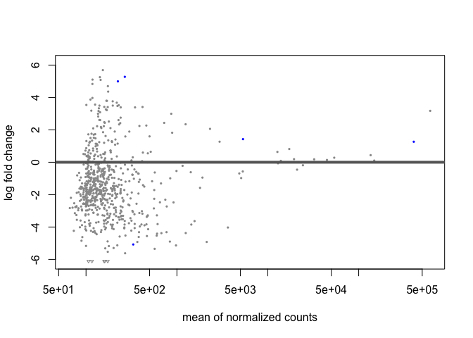<!-- -->

``` r
full_results1 <- as.data.frame(res1)
full_results1 <- cbind(Genes = rownames(full_results1), full_results1)
rownames(full_results1) <- NULL

p_cutoff <- 0.05
fc_cutoff <- 1
topN <- 20

options(ggrepel.max.overlaps = Inf)

test_sig <- full_results1 %>% 
  mutate(Significant = padj < p_cutoff, abs(log2FoldChange) > fc_cutoff ) %>% 
  mutate(Rank = 1:n(), Label = ifelse(Rank < topN, Genes,""))

test_sig %>% 
  ggplot(aes(x = log2FoldChange, y = stat, col=Significant,label=test_sig$Label)) + geom_point() + geom_text_repel(col="black")
```

    ## Warning: Use of `test_sig$Label` is discouraged. Use `Label` instead.
    ## Use of `test_sig$Label` is discouraged. Use `Label` instead.

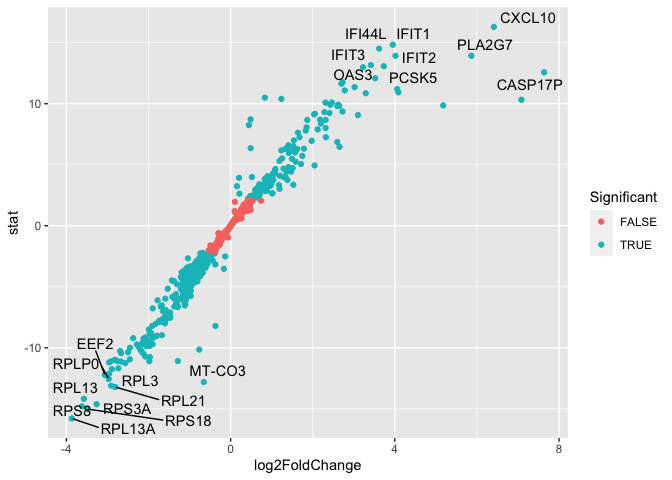<!-- -->

``` r
genes_of_interest <- test_sig %>% 
  filter(Rank < topN) %>% 
  pull(Genes)
```

``` r
full_results2 <- as.data.frame(res2)
full_results2 <- cbind(Genes = rownames(full_results2), full_results2)
rownames(full_results2) <- NULL

p_cutoff <- 0.05
fc_cutoff <- 1
topN <- 20

options(ggrepel.max.overlaps = Inf)

test_sig2 <- full_results2 %>% 
  mutate(Significant = padj < p_cutoff, abs(log2FoldChange) > fc_cutoff ) %>% 
  mutate(Rank = 1:n(), Label = ifelse(Rank < topN, Genes,""))

test_sig2 %>% 
  ggplot(aes(x = log2FoldChange, y = stat, col=Significant,label=test_sig2$Label)) + geom_point() + geom_text_repel(col="black")
```

    ## Warning: Use of `test_sig2$Label` is discouraged. Use `Label` instead.
    ## Use of `test_sig2$Label` is discouraged. Use `Label` instead.

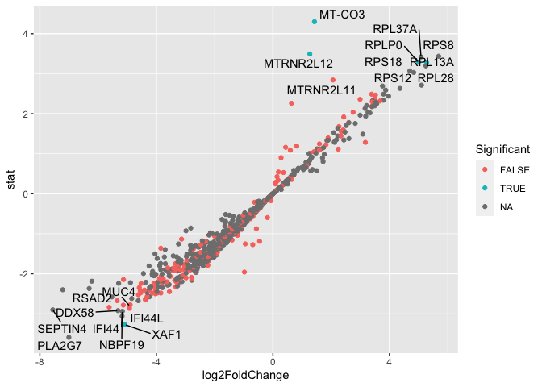<!-- -->

``` r
genes_of_interest2 <- test_sig2 %>% 
  filter(Rank < topN) %>% 
  pull(Genes)
```

# Using EdgeR

``` r
dge <- DGEList(counts = count_mat_final, samples = pdata_mod, group = pdata_mod$sarstest)
dim(dge)
```

    ## [1] 35784   467

``` r
apply(dge$counts, 2, sum) # total gene counts per sample
```

    ##  POS_001  POS_002  POS_003  POS_004  POS_005  POS_006  POS_007  POS_008 
    ##  1230730  2519860  2849945  2130923  4445875  7467886   839343  1007100 
    ##  POS_009  POS_010  POS_011  POS_012  POS_013  POS_014  POS_015  POS_016 
    ##  1854271   914828   631562  2255517  1518236   795243  3798852  1842797 
    ##  POS_017  POS_018  POS_019  POS_020  POS_021  POS_022  POS_023  POS_024 
    ##   550091  2521470  3450563  2158980  2376339   923705  1835256  1170998 
    ##  POS_025  POS_026  POS_027  POS_028  POS_029  POS_030  POS_031  POS_032 
    ##  1130346  3760064   869389  1782836  7187322  1073559   905653   779491 
    ##  POS_033  POS_034  POS_035  POS_036  POS_037  POS_039  POS_040  POS_041 
    ##  2490104   642270   807543   978010  1117342   569038   869311  1464069 
    ##  POS_042  POS_043  POS_044  POS_045  POS_046  POS_047  POS_048  POS_049 
    ##  1210695   554383   567533  1902661  1161552  1629068  1896009  1172197 
    ##  POS_050  POS_051  POS_052  POS_053  POS_055  POS_056  POS_057  POS_058 
    ##  2342246  2430907   822834   833252   717778  1994968  1914193   937043 
    ##  POS_059  POS_060  POS_061  POS_062  POS_063  POS_064  POS_065  POS_066 
    ##   554372   778122   619604   519730   534405  1449875  3000956  1264556 
    ##  POS_067  POS_068  POS_069  POS_070  POS_071  POS_072  POS_073  POS_074 
    ##   824022  1410798  3240680  3051982  3254214  2248506  7055085   981788 
    ##  POS_075  POS_076  POS_077  POS_078  POS_079  POS_080  POS_081  POS_082 
    ##  9773279  1966428  1862197  1731843  2895712  4513175  1618626  1266581 
    ##  POS_083  POS_084  POS_085  POS_086  POS_087  POS_088  POS_089  POS_090 
    ##  1213456  6392728   573182  3227699  3255725 11238359  1256472  1660697 
    ##  POS_092  POS_093  POS_094  POS_095  POS_096  POS_097  POS_098  POS_099 
    ##  2496526  1463932   702042   925522  1318411  2069705   768198  1878820 
    ##  POS_100  POS_101  POS_102  POS_103  POS_104  POS_105  POS_106  POS_107 
    ##  2201411  4183920  1055550   698910  2602823  5377038  1167589  1670629 
    ##  POS_108  POS_109  POS_111  POS_112  POS_113  POS_114  POS_115  POS_116 
    ##  1936908  6619244  2483771   499919  6600703  3412398  3098765  4711257 
    ##  POS_117  POS_118  POS_119  POS_120  POS_121  POS_122  POS_123  POS_124 
    ##  1727384  1433304   795624   806123   794266  3820160   912108  2913829 
    ##  POS_125  POS_126  POS_127  POS_128  POS_129  POS_130  POS_131  POS_132 
    ##  1320954  2907340   592526   899170  2629934  1202473   693698   617524 
    ##  POS_133  POS_134  POS_135  POS_136  POS_137  POS_138  POS_139  POS_141 
    ##  2055021  1825544  1168422  6300807   849627  5173370  1822385  1299425 
    ##  POS_142  POS_143  POS_144  POS_145  POS_146  POS_147  POS_148  POS_149 
    ##  2037242  1044332  2357160  1267306   567246   646158   507929  2625453 
    ##  POS_150  POS_151  POS_152  POS_153  POS_154  POS_155  POS_156  POS_157 
    ##   698196  1613149   670716  2178975  2969908   657549   785429   997136 
    ##  POS_158  POS_159  POS_160  POS_161  POS_162  POS_163  POS_164  POS_165 
    ##   552441  1875405  1752209  7484712   821181  1135852   970967  1439681 
    ##  POS_166  POS_167  POS_168  POS_169  POS_170  POS_171  POS_172  POS_173 
    ##  1058003  2849812  1478856   496061   694118  2051568  1107058  1654852 
    ##  POS_174  POS_175  POS_176  POS_177  POS_178  POS_179  POS_180  POS_181 
    ##  4177321  1774749  1024366   850457   537037   525908   832142  4062507 
    ##  POS_182  POS_183  POS_184  POS_185  POS_186  POS_187  POS_188  POS_189 
    ##   752479  2763587  1285228  3031815  1117465  1368511  1388932  3163041 
    ##  POS_190  POS_191  POS_192  POS_193  POS_194  POS_195  POS_196  POS_197 
    ##   550615  1748628  1625492  1441936  1594531   646204  1429799  1640049 
    ##  POS_198  POS_199  POS_200  POS_201  POS_202  POS_203  POS_204  POS_205 
    ##  3371746  1107185   714902  1512185  2499787  1556764  1730887  1882466 
    ##  POS_206  POS_207  POS_208  POS_209  POS_210  POS_211  POS_212  POS_213 
    ##  5066820  2781969   781790  2761833  2032793  1883950   544782  1845337 
    ##  POS_214  POS_215  POS_216  POS_217  POS_218  POS_219  POS_220  POS_221 
    ##  3273631  1102462  1146779  4738873  1541600  2866567   771223   597368 
    ##  POS_222  POS_223  POS_224  POS_225  POS_226  POS_227  POS_228  POS_229 
    ##   737729  2307620  1752089  1509935  1921925  1213328  6944628  3713896 
    ##  POS_230  POS_231  POS_232  POS_233  POS_234  POS_236  POS_237  POS_238 
    ##  3647875   978770  4904462   791711  1453136  1323946  5549010  1231954 
    ##  POS_239  POS_240  POS_241  POS_242  POS_243  POS_244  POS_245  POS_246 
    ##  4222422  1317758  1563355  1563085   514893   845586  3044725  1473577 
    ##  POS_247  POS_249  POS_250  POS_251  POS_252  POS_253  POS_254  POS_255 
    ##  4636324 13728635  4337542  4544397  4146734   909073  1888876   581957 
    ##  POS_256  POS_257  POS_258  POS_259  POS_260  POS_261  POS_262  POS_263 
    ##  1775130  1585114  4452927   724998  3039366  2620266  2068479  2173815 
    ##  POS_264  POS_265  POS_266  POS_267  POS_268  POS_269  POS_270  POS_271 
    ##  2647301   647726   769254  2404391   644250  1238536   610939  1517483 
    ##  POS_272  POS_273  POS_274  POS_275  POS_276  POS_277  POS_278  POS_279 
    ##  1243327   612690  1369847  1449449   804699   552615  1209484  1546821 
    ##  POS_280  POS_281  POS_282  POS_283  POS_284  POS_285  POS_286  POS_287 
    ##  1428111   716024  1342219  1070184  2728161   867944   928583   939283 
    ##  POS_288  POS_289  POS_290  POS_291  POS_292  POS_293  POS_295  POS_296 
    ##  1821595  3983753  2338756  1153119   539975  2019543  1452481   644574 
    ##  POS_297  POS_298  POS_299  POS_300  POS_301  POS_302  POS_303  POS_304 
    ##   578682   916237   601895  2701132  1472476  2260400  1223050 11442147 
    ##  POS_305  POS_306  POS_307  POS_308  POS_309  POS_310  POS_311  POS_312 
    ##  1074704 28369964  8033626  1395930   594735  1595504  4893611  3250468 
    ##  POS_313  POS_314  POS_315  POS_316  POS_317  POS_318  POS_319  POS_320 
    ##  2837116   497672   927616  1685151  5084484  1463745  4355944   740393 
    ##  POS_321  POS_322  POS_323  POS_324  POS_325  POS_326  POS_327  POS_328 
    ##  1570161  1670053  2320697   811230  1651584  1561879  1397049   667782 
    ##  POS_329  POS_330  POS_331  POS_332  POS_333  POS_334  POS_335  POS_336 
    ##  1307979  1147679  1610539  2102797  2541020  2011402  1134383   849165 
    ##  POS_337  POS_338  POS_339  POS_340  POS_341  POS_342  POS_343  POS_344 
    ##  1471363   971027  5710554  1681577  1121438  1717799  3612296  2356717 
    ##  POS_345  POS_346  POS_347  POS_348  POS_349  POS_350  POS_351  POS_352 
    ##  1139968  1736414  1492971  1295152  1386622  2644329   627676  1246760 
    ##  POS_353  POS_354  POS_355  POS_356  POS_357  POS_358  POS_359  POS_360 
    ##  1604096  7168114  4464674  5025958  3733860  5010686  2839156  3401014 
    ##  POS_361  POS_362  POS_363  POS_364  POS_365  POS_366  POS_367  POS_368 
    ##  4374185  3542639  1345882  1073326  5236785  9363634  2082767  4352435 
    ##  POS_369  POS_370  POS_371  POS_372  POS_373  POS_374  POS_375  POS_376 
    ##  2542128  6132888  5132572  1323241  6226888  1517328  1140179  1905607 
    ##  POS_377  POS_378  POS_379  POS_380  POS_381  POS_382  POS_383  POS_384 
    ##  1143734  3485481   773123  2265087  1796231   977663  3877498   782679 
    ##  POS_385  POS_386  POS_387  POS_388  POS_389  POS_390  POS_391  POS_392 
    ##   886189  3971841  4153359  2394438  4580978  2098025   775870  2697166 
    ##  POS_393  POS_394  POS_395  POS_396  POS_397  POS_398  POS_399  POS_400 
    ##  2350252  1935210  1476489  1554316  4466341  2394876  2414540  1387389 
    ##  POS_401  POS_402  POS_403  POS_404  POS_405  POS_406  POS_407  POS_408 
    ##  4283770   630287  1841307  1043017  2774667  2602124  2157936  7328751 
    ##  POS_409  POS_410  POS_411  POS_412  POS_413  POS_414  POS_415  POS_416 
    ##  2970608   998084 10929530  1922028  4492803  1263718  1926914   845538 
    ##  POS_417  POS_418  POS_419  POS_420  POS_421  NEG_001  NEG_002  NEG_003 
    ##  2195873  1693584  1056335  1109079  1590652  2433630  1721398  3680808 
    ##  NEG_004  NEG_005  NEG_006  NEG_007  NEG_008  NEG_009  NEG_010  NEG_011 
    ##  1911136  1146705  2380633  2701883  1214007  1372747  2414832  1801345 
    ##  NEG_012  NEG_013  NEG_014  NEG_016  NEG_018  NEG_019  NEG_020  NEG_021 
    ##  2212166  1133458  9949865  4951046   857023   576316  1251039   821588 
    ##  NEG_022  NEG_023  NEG_024  NEG_025  NEG_026  NEG_027  NEG_028  NEG_030 
    ##  2648318   846641 32915156  2214733  1016677   860869   697404  1038568 
    ##  NEG_031  NEG_032  NEG_035  NEG_036  NEG_037  NEG_038  NEG_039  NEG_040 
    ##   735437  2264200  1658680   722746  1829160  2343977 35593921  6253974 
    ##  NEG_042  NEG_043  NEG_046  NEG_047  NEG_048  NEG_049  NEG_050  NEG_051 
    ## 15332347  8822883   673222   862980  2165071  1250417  2601938  4193900 
    ##  NEG_052  NEG_054  NEG_055  NEG_056  NEG_057  NEG_058  NEG_059  NEG_060 
    ##  1470317  2402725  2067759  1830001  5386180  1212904  2543569  1348322 
    ##  NEG_062  NEG_063  NEG_065 
    ##  1706710  2371613  1463319

``` r
keep_edge <- rowSums(cpm(dge)>100) >= 50
dge_mod <- dge[keep_edge,]
dim(dge_mod)
```

    ## [1] 679 467

``` r
dge$samples$lib.size <- colSums(dge$counts) # Reset library sizes
```

``` r
#Calculating TMM normalization factors and directly adding them to the DGEList
dge_norm = calcNormFactors(dge_mod, method = "TMM")

cpm = cpm(dge_norm, log = FALSE, normalized.lib.sizes = TRUE)
log2cpm = log2(cpm + 1)

#Transforming object from wide to long format for plotting 
ran_samp <- subset(log2cpm[,150:170])

longExpr = ran_samp %>% 
           as.data.frame() %>% 
           rownames_to_column("gene") %>%
           pivot_longer(cols = !gene,
                        values_to = "Expression",
                        names_to = "sample_ID")

longExpr  %>% 
  ggplot(aes(x = Expression, color = sample_ID)) +
  geom_density() +
  labs( x = "Expression", y = "Density", title = "Density plot showing distribution of gene expression across 20 random samples")
```

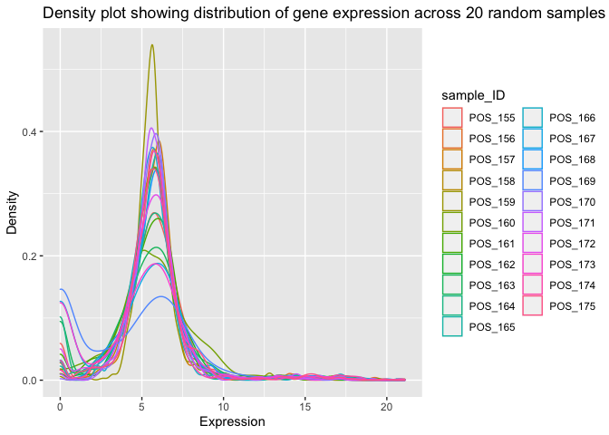<!-- -->

``` r
longExpr %>% 
  ggplot(aes(x = sample_ID, y = Expression)) +
  geom_boxplot() +
  theme(axis.text.x = element_text(angle = 90, hjust = 1))  +
  labs( x = "Sample ID", y = "Gene Expression", title = "Box plot showing distribution of gene expression across 20 random samples")
```

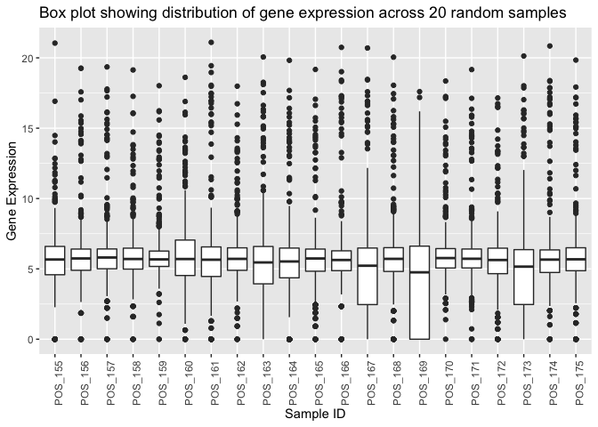<!-- -->

``` r
#Calculate correlation using log2 transformed CPM values from earlier
cormat = round(cor(ran_samp), 2)

#Plot heatmap
pheatmap(cormat, border_color = NA, cluster_rows = TRUE, cellheight=9, cellwidth = 9)
```

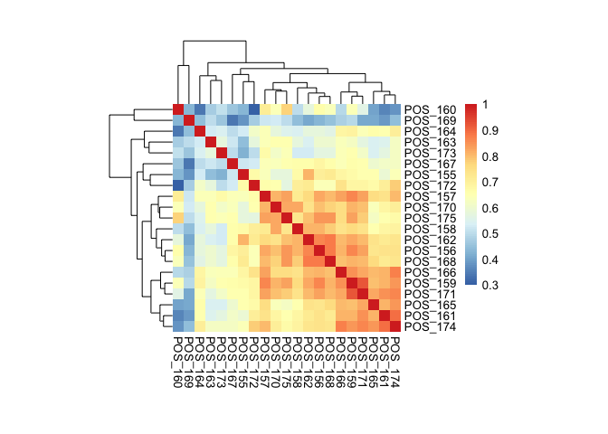<!-- -->

``` r
#Setting up model matrix
designMatrix1 = model.matrix(~Sars_test , data = colData(sumexp))
designMatrix2 = model.matrix(~Sars_test + Batch , data = colData(sumexp))
```

``` r
#Calculation of variance weights and generation of mean-variance trend plot
de_model1 = voom(dge_norm, design = designMatrix1, plot = TRUE)
```

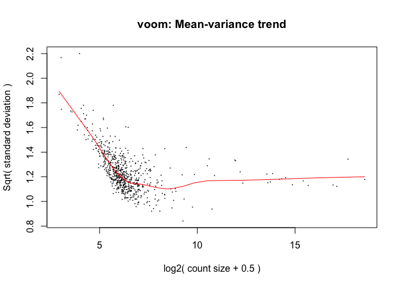<!-- -->

``` r
de_model2 = voom(dge_norm, design = designMatrix2, plot = TRUE)
```

<!-- -->

``` r
dge_disp1 <- estimateDisp(dge_norm, designMatrix1, robust = TRUE)
range(dge_disp1$prior.df)
```

    ## [1] 3.728278 7.783419

``` r
plotBCV(dge_disp1,  cex=0.5)
```

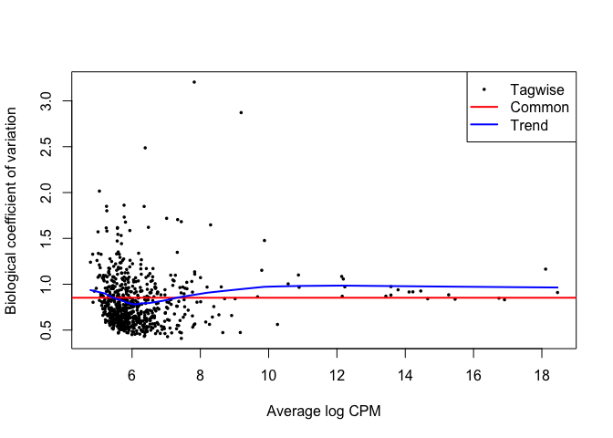<!-- -->

``` r
dge_disp2 <- estimateDisp(dge_norm, designMatrix2, robust = TRUE)
range(dge_disp2$prior.df)
```

    ## [1] 5.647342 9.169291

``` r
plotBCV(dge_disp2,  cex=0.5)
```

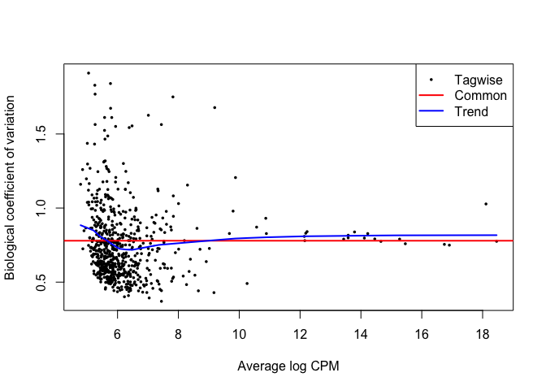<!-- -->

``` r
lfit1 <- glmFit(dge_disp1, designMatrix1)
lrt1 <- glmLRT(lfit1, coef = "Sars_testpos")
toptags1 <- topTags(lrt1)$table %>% signif(3)

lfit2 <- glmFit(dge_disp2, designMatrix2)
lrt2 <- glmLRT(lfit2, coef = "Sars_testpos")
toptags2 <- topTags(lrt2)$table %>% signif(3)
```

``` r
de1 <- decideTestsDGE(lrt1, adjust.method="BH", p.value = 0.05)
de1tags1 <- rownames(dge_disp1)[as.logical(de1)]
plotSmear(lrt1, de.tags=de1tags1)
```

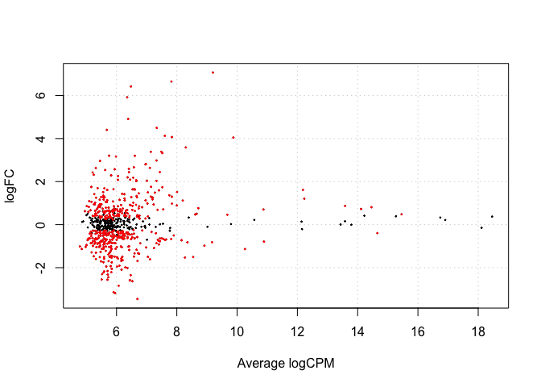<!-- -->

``` r
#abline(h = c(-1, 1), col = "blue")
summary(de1)
```

    ##        Sars_testpos
    ## Down            249
    ## NotSig          215
    ## Up              215

``` r
de2 <- decideTestsDGE(lrt2, adjust.method="BH", p.value = 0.05)
de1tags2 <- rownames(dge_disp2)[as.logical(de2)]
plotSmear(lrt2, de.tags=de1tags2)
```

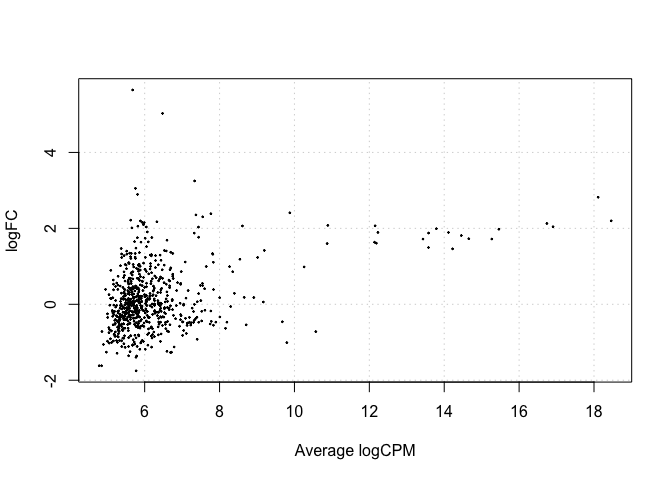<!-- -->

``` r
#abline(h = c(-1, 1), col = "blue")
summary(de2)
```

    ##        Sars_testpos
    ## Down              0
    ## NotSig          679
    ## Up                0
