Data Cleaning and Initial DE Analysis
================
Credo Casmil, Aditi Nagaraj Nallan, Ekpereka Amutaigwe and Dollina
Dodani
2022-03-10

# Load packages

``` r
suppressPackageStartupMessages(library(tidyverse))
suppressPackageStartupMessages(library(GEOquery))
suppressPackageStartupMessages(library(limma))
suppressPackageStartupMessages(library(edgeR))
suppressPackageStartupMessages(library(pheatmap))
suppressPackageStartupMessages(library(statmod))
suppressPackageStartupMessages(library(ggrepel))
suppressPackageStartupMessages(library(ggbiplot))
suppressPackageStartupMessages(library(ggplot2))
suppressPackageStartupMessages(library(caTools)) ## used for splitting the data into training and validation sets 
suppressPackageStartupMessages(library(caret)) ## used for confusion matrix, accuracy, sensitivity, and specificity
```

``` r
eset <- getGEO("GSE152075", getGPL = FALSE)[[1]]
getGEOSuppFiles("GSE152075")

#Read in the count matrix
raw_counts <- read.csv("GSE152075/GSE152075_raw_counts_GEO.txt", sep = "")
count_mat <- as.matrix(raw_counts,row.names="gene_id")
```

``` r
#Read in the metadata
pdata <- eset@phenoData@data %>% as_tibble()

#Clean the metadata to include only columns of interest for the initial analysis
pdata_clean = pdata %>%
  select(title, `age:ch1`, characteristics_ch1.3, characteristics_ch1.4, `sars-cov-2 positivity:ch1`)
colnames(pdata_clean) = c("Title", "Age", "Gender", "Batch", "Sars_test")

#Modify the cleaned data set as per further DE analysis
pdata_mod <- pdata_clean %>%
  subset(Age != "Unknown") %>%
  transform(Age = as.numeric(Age))
```

    ## Warning in eval(substitute(list(...)), `_data`, parent.frame()): NAs introduced
    ## by coercion

``` r
colnames(pdata_mod) = c("Title", "Age", "Gender", "Batch", "Sars_test")
pdata_mod[is.na(pdata_mod)] <- 90

pdata_mod = pdata_mod %>%
  mutate(Age_category =  case_when(
    Age < 18 ~ "Child",
    Age >= 18 & Age < 35 ~ "Young Adult",
    Age >= 35 & Age < 65  ~ "Adult",
    TRUE ~ "Senior"
  ))

data = pdata %>%
       select(title, `age:ch1`) %>% 
       subset(`age:ch1` == "Unknown")

drop <- data$title
count_mat_final  = count_mat[,!colnames(count_mat) %in% drop]
```

# Using EdgeR

``` r
#Creating DGE List 
dge <- DGEList(counts = count_mat, samples = pdata_clean, group = pdata_clean$Sars_test)
dim(dge)
```

    ## [1] 35784   484

``` r
head(apply(dge$counts, 2, sum)) # total gene counts per sample
```

    ## POS_001 POS_002 POS_003 POS_004 POS_005 POS_006 
    ## 1230730 2519860 2849945 2130923 4445875 7467886

``` r
#removing lowly expressed genes
keep_edge <- rowSums(cpm(dge)>100) >= 50
dge_mod <- dge[keep_edge,]
dim(dge_mod)
```

    ## [1] 699 484

``` r
dge$samples$lib.size <- colSums(dge$counts) # Reset library sizes
```

``` r
#Calculating TMM normalization factors and directly adding them to the DGEList
dge_norm = calcNormFactors(dge_mod, method = "TMM")

cpm = cpm(dge_norm, log = FALSE, normalized.lib.sizes = TRUE)
log2cpm = log2(cpm + 1)

#Transforming object from wide to long format for plotting after randomly subsetting the data
ran_samp <- subset(log2cpm[,150:170])

longExpr = ran_samp %>% 
           as.data.frame() %>% 
           rownames_to_column("gene") %>%
           pivot_longer(cols = !gene,
                        values_to = "Expression",
                        names_to = "sample_ID")

#Density plot for a random subset of data for ease of visualization 
longExpr  %>% 
  ggplot(aes(x = Expression, color = sample_ID)) +
  geom_density() +
  labs( x = "Expression", y = "Density", title = "Density plot showing distribution of gene expression across 20 random samples")
```

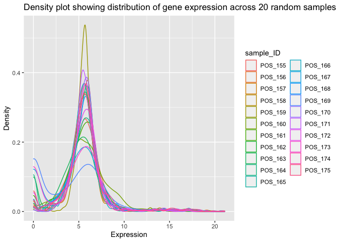<!-- -->

``` r
#Box plot for a random subset of data for ease of visualization 
longExpr %>% 
  ggplot(aes(x = sample_ID, y = Expression)) +
  geom_boxplot() +
  theme(axis.text.x = element_text(angle = 90, hjust = 1))  +
  labs( x = "Sample ID", y = "Gene Expression", title = "Box plot showing distribution of gene expression across 20 random samples")
```

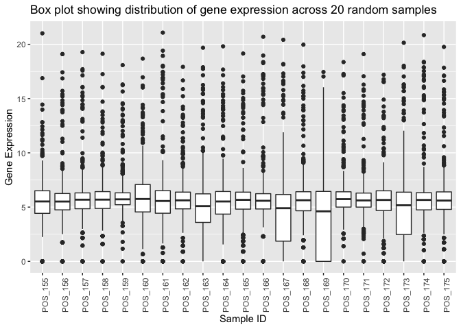<!-- -->

``` r
#Calculate correlation using log2 transformed random subset CPM values from earlier
cormat = round(cor(ran_samp), 2)

#Plot heatmap
pheatmap(cormat, border_color = NA, cluster_rows = TRUE, cellheight=9, cellwidth = 9)
```

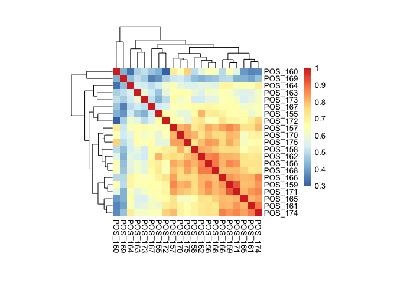<!-- -->

``` r
#Setting up model matrix: Batch corrected and Batch not corrected
designMatrix1 = model.matrix(~Sars_test , data = dge_norm$samples)
designMatrix2 = model.matrix(~Sars_test + Batch , data = dge_norm$samples)
```

``` r
#Calculation of variance weights and generation of mean-variance trend plot
de_model1 = voom(dge_norm, design = designMatrix1, plot = TRUE)
```

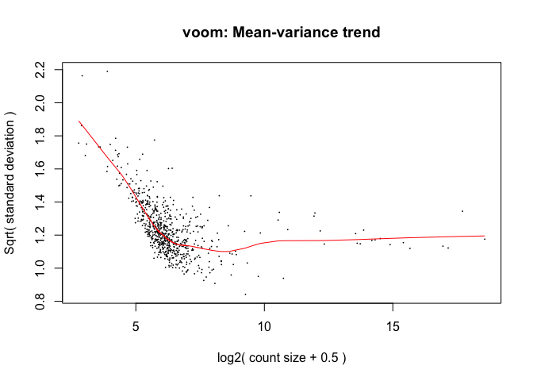<!-- -->

``` r
de_model2 = voom(dge_norm, design = designMatrix2, plot = TRUE)
```

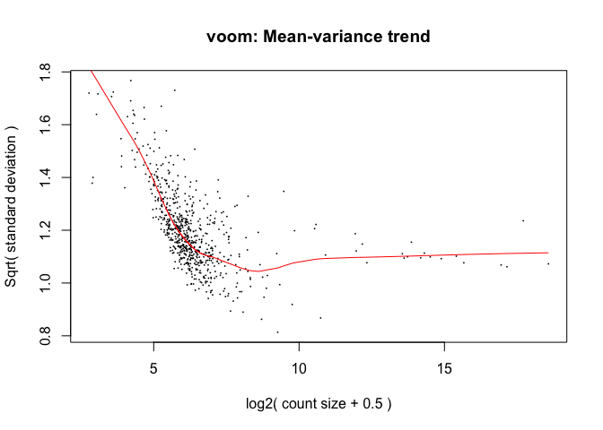<!-- -->

``` r
dge_disp1 <- estimateDisp(dge_norm, designMatrix1, robust = TRUE)
range(dge_disp1$prior.df)
```

    ## [1] 3.648507 7.814706

``` r
plotBCV(dge_disp1,  cex=0.5)
```

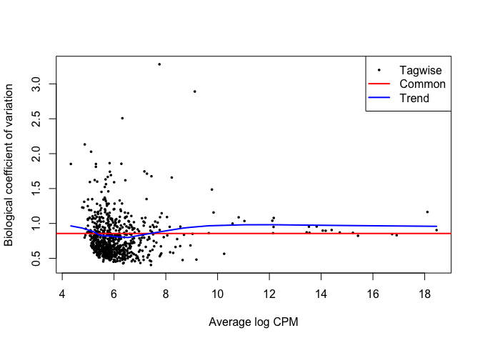<!-- -->

``` r
dge_disp2 <- estimateDisp(dge_norm, designMatrix2, robust = TRUE)
range(dge_disp2$prior.df)
```

    ## [1] 5.108595 9.173370

``` r
plotBCV(dge_disp2,  cex=0.5)
```

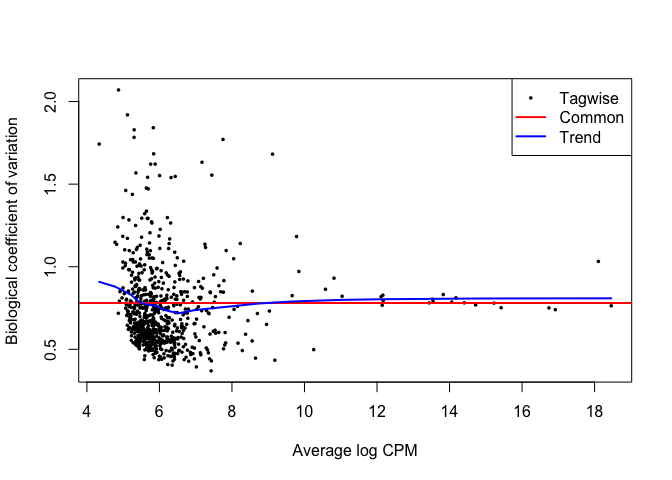<!-- -->

``` r
lfit1 <- glmFit(dge_disp1, designMatrix1)
lrt1 <- glmLRT(lfit1, coef = "Sars_testpos")
toptags1 <- topTags(lrt1)$table %>% signif(3)

lfit2 <- glmFit(dge_disp2, designMatrix2)
lrt2 <- glmLRT(lfit2, coef = "Sars_testpos")
toptags2 <- topTags(lrt2)$table %>% signif(3)

#Filtering for up and downregulated genes
lrt2_filter_upreg <- filter(lrt2$table, PValue < 0.05, logFC >1)
dim(lrt2_filter_upreg)
```

    ## [1] 45  4

``` r
lrt2_filter_downreg <- filter(lrt2$table, PValue < 0.05, logFC < -1)
dim(lrt2_filter_downreg)
```

    ## [1] 21  4

``` r
de1 <- decideTestsDGE(lrt1, adjust.method="BH", p.value = 0.05)
de1tags1 <- rownames(dge_disp1)[as.logical(de1)]
plotSmear(lrt1, de.tags=de1tags1)
```

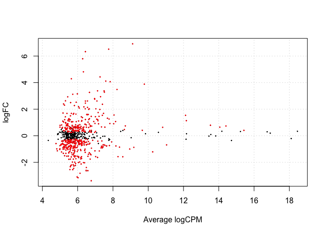<!-- -->

``` r
de1_summary <- summary(de1)
de1_summary
```

    ##        Sars_testpos
    ## Down            261
    ## NotSig          226
    ## Up              212

``` r
de2 <- decideTestsDGE(lrt2, adjust.method="BH", p.value = 0.05)
de1tags2 <- rownames(dge_disp2)[as.logical(de2)]
plotSmear(lrt2, de.tags=de1tags2)
```

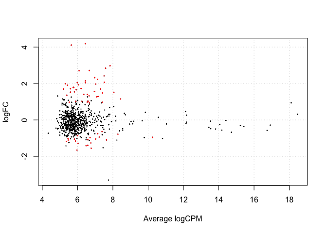<!-- -->

``` r
de2_summary <- summary(de2)
de2_summary
```

    ##        Sars_testpos
    ## Down             21
    ## NotSig          635
    ## Up               43

# Principal Component Analysis

``` r
# Convert rownames to column
lrt2_upreg_mod <- lrt2_filter_upreg %>% 
                  rownames_to_column("gene")
lrt2_downreg_mod <- lrt2_filter_downreg %>% 
                   rownames_to_column("gene")

# Merge up-regulated and down-regulated gene data frames
lrt2_upreg_downreg <- rbind(lrt2_upreg_mod, lrt2_downreg_mod)
nrow(lrt2_upreg_downreg)
```

    ## [1] 66

``` r
# Filter data to retain only the up-regulated genes
log2cpm_dat <-  log2cpm %>% 
                as.data.frame() %>% 
                rownames_to_column("gene") %>% 
                filter(gene %in% lrt2_upreg_downreg$gene) %>% 
  # Change data to a long form
                pivot_longer(cols = !gene,
                             values_to = "Expression",
                             names_to = "sample_ID")

# Rename column to join by
pdata_clean <- dplyr::rename(pdata_clean, sample_ID = Title)

# Join expression and metadata data sets
DEG_new <- log2cpm_dat %>% 
           left_join(pdata_clean, 
                     by = "sample_ID") 

# Transform data back to a wide format
DEG_new_trans <- pivot_wider(DEG_new, 
                             id_cols = c(sample_ID, Age, Gender, Batch, Sars_test), 
                             names_from = gene, 
                             values_from = Expression)

# Use to drop missing values in case there's any before PCA
DEG_new_trans2 <- DEG_new_trans %>% 
                  drop_na() 

# Perform PCA
pca_DEG_new_trans2 <- prcomp(DEG_new_trans2[,-c(1, 2, 3, 4, 5, 6), 
                                            center = TRUE, 
                                            scale = TRUE])
# See what PCA result looks like
summary(pca_DEG_new_trans2)
```

    ## Importance of components:
    ##                           PC1    PC2     PC3     PC4     PC5     PC6    PC7
    ## Standard deviation     8.8450 5.3090 3.80088 3.52921 2.71909 2.51337 1.9498
    ## Proportion of Variance 0.3868 0.1394 0.07143 0.06158 0.03655 0.03123 0.0188
    ## Cumulative Proportion  0.3868 0.5262 0.59757 0.65915 0.69570 0.72694 0.7457
    ##                            PC8     PC9    PC10    PC11    PC12    PC13    PC14
    ## Standard deviation     1.82645 1.69888 1.55422 1.50729 1.42810 1.36273 1.35431
    ## Proportion of Variance 0.01649 0.01427 0.01194 0.01123 0.01008 0.00918 0.00907
    ## Cumulative Proportion  0.76222 0.77649 0.78844 0.79967 0.80975 0.81893 0.82800
    ##                           PC15    PC16    PC17    PC18    PC19    PC20    PC21
    ## Standard deviation     1.31991 1.27618 1.25326 1.22094 1.21343 1.17671 1.12944
    ## Proportion of Variance 0.00861 0.00805 0.00777 0.00737 0.00728 0.00685 0.00631
    ## Cumulative Proportion  0.83662 0.84467 0.85243 0.85980 0.86708 0.87393 0.88024
    ##                           PC22    PC23    PC24    PC25    PC26    PC27    PC28
    ## Standard deviation     1.12715 1.06177 1.04624 1.02875 0.99819 0.98147 0.97051
    ## Proportion of Variance 0.00628 0.00557 0.00541 0.00523 0.00493 0.00476 0.00466
    ## Cumulative Proportion  0.88652 0.89209 0.89750 0.90273 0.90766 0.91242 0.91708
    ##                           PC29    PC30    PC31   PC32    PC33    PC34    PC35
    ## Standard deviation     0.95305 0.92362 0.92268 0.8884 0.86859 0.83396 0.81892
    ## Proportion of Variance 0.00449 0.00422 0.00421 0.0039 0.00373 0.00344 0.00332
    ## Cumulative Proportion  0.92157 0.92579 0.93000 0.9339 0.93763 0.94107 0.94438
    ##                           PC36    PC37    PC38   PC39    PC40    PC41    PC42
    ## Standard deviation     0.80232 0.79543 0.78169 0.7784 0.76940 0.76019 0.72846
    ## Proportion of Variance 0.00318 0.00313 0.00302 0.0030 0.00293 0.00286 0.00262
    ## Cumulative Proportion  0.94757 0.95069 0.95371 0.9567 0.95964 0.96249 0.96512
    ##                           PC43    PC44    PC45    PC46    PC47    PC48   PC49
    ## Standard deviation     0.72143 0.70052 0.68780 0.67695 0.66404 0.63771 0.6198
    ## Proportion of Variance 0.00257 0.00243 0.00234 0.00227 0.00218 0.00201 0.0019
    ## Cumulative Proportion  0.96769 0.97012 0.97246 0.97472 0.97690 0.97891 0.9808
    ##                           PC50   PC51    PC52    PC53   PC54    PC55    PC56
    ## Standard deviation     0.60544 0.5690 0.56303 0.54470 0.5329 0.52244 0.50773
    ## Proportion of Variance 0.00181 0.0016 0.00157 0.00147 0.0014 0.00135 0.00127
    ## Cumulative Proportion  0.98262 0.9842 0.98579 0.98726 0.9887 0.99001 0.99129
    ##                           PC57   PC58    PC59    PC60    PC61    PC62    PC63
    ## Standard deviation     0.49805 0.4918 0.48667 0.45327 0.43314 0.43008 0.40549
    ## Proportion of Variance 0.00123 0.0012 0.00117 0.00102 0.00093 0.00091 0.00081
    ## Cumulative Proportion  0.99251 0.9937 0.99488 0.99590 0.99682 0.99774 0.99855
    ##                           PC64    PC65
    ## Standard deviation     0.39932 0.36573
    ## Proportion of Variance 0.00079 0.00066
    ## Cumulative Proportion  0.99934 1.00000

``` r
# What are the components of the PCA result
str(pca_DEG_new_trans2)
```

    ## List of 5
    ##  $ sdev    : num [1:65] 8.85 5.31 3.8 3.53 2.72 ...
    ##  $ rotation: num [1:65, 1:65] 0.00109 -0.01608 0.16612 0.22642 0.14833 ...
    ##   ..- attr(*, "dimnames")=List of 2
    ##   .. ..$ : chr [1:65] "CBX5" "CCNI" "CMPK2" "CXCL10" ...
    ##   .. ..$ : chr [1:65] "PC1" "PC2" "PC3" "PC4" ...
    ##  $ center  : Named num [1:65] 4.95 5.51 4.64 4.25 3.93 ...
    ##   ..- attr(*, "names")= chr [1:65] "CBX5" "CCNI" "CMPK2" "CXCL10" ...
    ##  $ scale   : logi FALSE
    ##  $ x       : num [1:484, 1:65] 5.82 9.35 -6.09 7.94 2.27 ...
    ##   ..- attr(*, "dimnames")=List of 2
    ##   .. ..$ : NULL
    ##   .. ..$ : chr [1:65] "PC1" "PC2" "PC3" "PC4" ...
    ##  - attr(*, "class")= chr "prcomp"

``` r
# Visualize PCA result by gender
ggbiplot(pca_DEG_new_trans2, 
         ellipse = TRUE, 
         var.axes = FALSE,
         obs.scale = 1,
         var.scale = 1,
         groups = DEG_new_trans2$Gender) +
  ggtitle("PCA of SARS-Cov2 gene expression by gender") +
  theme_bw()
```

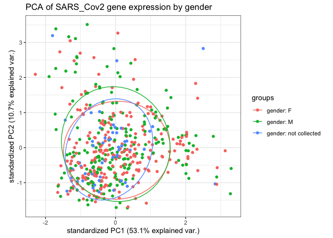<!-- -->

``` r
# Visualize PCA result by infection status
ggbiplot(pca_DEG_new_trans2, 
         ellipse = TRUE,
         obs.scale = 1,
         var.scale = 1,
         groups = DEG_new_trans2$Sars_test) + 
  ggtitle("PCA of SARS-Cov2 gene expression by infection status") +
  theme_bw()
```

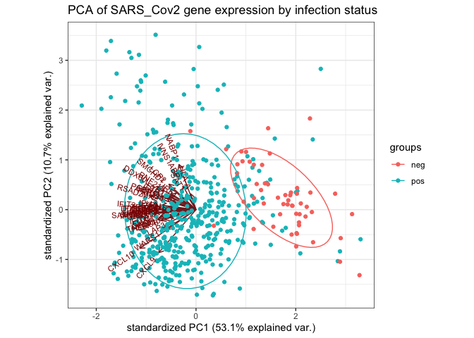<!-- -->

``` r
# Determine total variance explained by each principal component
variance_expl <- pca_DEG_new_trans2$sdev^2 / sum(pca_DEG_new_trans2$sdev^2)

# create scree plot
qplot(c(1:65), variance_expl) +
  geom_line() +
  xlab("Principal Component") +
  ylab("Variance explained") +
  ggtitle("Scree Plot of Principal Components") +
  ylim(0, 0.75) +
  theme_bw()
```

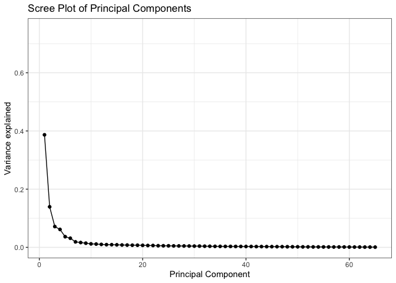<!-- -->

# Logistic regression classifier

We aim to build a logistic regression model to predict if a patient is
infected with COVID-19 given their RNA-seq data. Our initial analysis
(above) returns a set of 64 (confirm number) genes that were
differentially expressed given the infection status. While it would be
ideal to use all 64 genes to perform the classification, such a task
would be not only computationally heavy but also have a lot of noise.
This noise could arise because it is possible that some of the DEGs are
correlated and produce similar signals, hence misleading our
interpretation. In order to prevent this, we performed PCA on the DEGs
(above). From the above Scree/Elbow plot, it is evident that the first
four PCs explain \~66% of the variance in the dataset. In our regression
model, we therefore, only use 4 PCs.

``` r
## We first subset the PCA data so that we only have the first 4 columns (PCs) to work with 
PCA_data_subset <- as.data.frame(pca_DEG_new_trans2$x[, c(1, 2, 3, 4)])

## Our dataset has "pos" or 'neg" for the status. Such labels are incompatible with logistic regression which requires labels to be 1 or 0. 

labels_list <-gsub("pos", 1, DEG_new_trans2$Sars_test)
labels_list <-gsub("neg", 0, labels_list)

## Next, we assign the class labels to our subsetted data (Infected vs Uninfected). We will call this column status
PCA_data_subset$status <- as.numeric(labels_list)

## Splitting our dataset (PCA_data_subset) into a training and validation set. We will use a split of 80:20. That means, 80% of our original data will be used for training and 20% for validating our model. 
set.seed(123) ## Setting seed so we get the same split every time we run this code block
split = sample.split(PCA_data_subset$status, SplitRatio = 0.80) #This function will return a boolean vector. It indicates if the sample belongs to the training set (TRUE) or validation set (FALSE)

training_set = subset(PCA_data_subset, split == TRUE) ## Filter to get rows where split is TRUE
test_set = subset(PCA_data_subset, split == FALSE) ## Filter to get rows where split is FALSE

## Training the classifier. Note to self: still need to think if family=binomial is the best option.
classifier = glm(formula = status ~ .,family = binomial, data = training_set)

## Sanity check! Look at coefficients - only PC3 is significant? 
summary(classifier) 
```

    ## 
    ## Call:
    ## glm(formula = status ~ ., family = binomial, data = training_set)
    ## 
    ## Deviance Residuals: 
    ##     Min       1Q   Median       3Q      Max  
    ## -3.2400   0.0153   0.0444   0.1247   1.7203  
    ## 
    ## Coefficients:
    ##              Estimate Std. Error z value Pr(>|z|)    
    ## (Intercept)  5.494284   0.808921   6.792  1.1e-11 ***
    ## PC1          0.377337   0.057810   6.527  6.7e-11 ***
    ## PC2          0.005893   0.082860   0.071  0.94330    
    ## PC3         -0.446119   0.125287  -3.561  0.00037 ***
    ## PC4         -0.245889   0.106045  -2.319  0.02041 *  
    ## ---
    ## Signif. codes:  0 '***' 0.001 '**' 0.01 '*' 0.05 '.' 0.1 ' ' 1
    ## 
    ## (Dispersion parameter for binomial family taken to be 1)
    ## 
    ##     Null deviance: 269.996  on 386  degrees of freedom
    ## Residual deviance:  69.572  on 382  degrees of freedom
    ## AIC: 79.572
    ## 
    ## Number of Fisher Scoring iterations: 8

``` r
## Prediction on the validation set
prob_pred = predict(classifier, type = 'response', newdata = test_set[-5]) ## Will return a vector of predicted probablities of belong to infected (1) vs uninfected (0)

## Since this is a classification problem, we do not want probablities but instead either 1 or 0.
y_pred = ifelse(prob_pred > 0.5, 1, 0) ## Will round the probabilities to 1 or 0

## Checking how accurate our model is
cm = table(test_set[, 5], y_pred) ## Will return a confusion matrix. We notice that 1 COVID 19 patients were misclassfied as healthy and 3 healthy patients were misclassified as diseased.
cm
```

    ##    y_pred
    ##      0  1
    ##   0  8  3
    ##   1  1 85

``` r
## will now calculate Accuracy, Sensitivity and Specificity 
con_mat = confusionMatrix(cm, positive = "1")
c(con_mat$overall["Accuracy"], con_mat$byClass["Sensitivity"], con_mat$byClass["Specificity"])
```

    ##    Accuracy Sensitivity Specificity 
    ##   0.9587629   0.9659091   0.8888889

References <https://www.datacamp.com/community/tutorials/pca-analysis-r>
<https://www.statology.org/scree-plot-r/>
